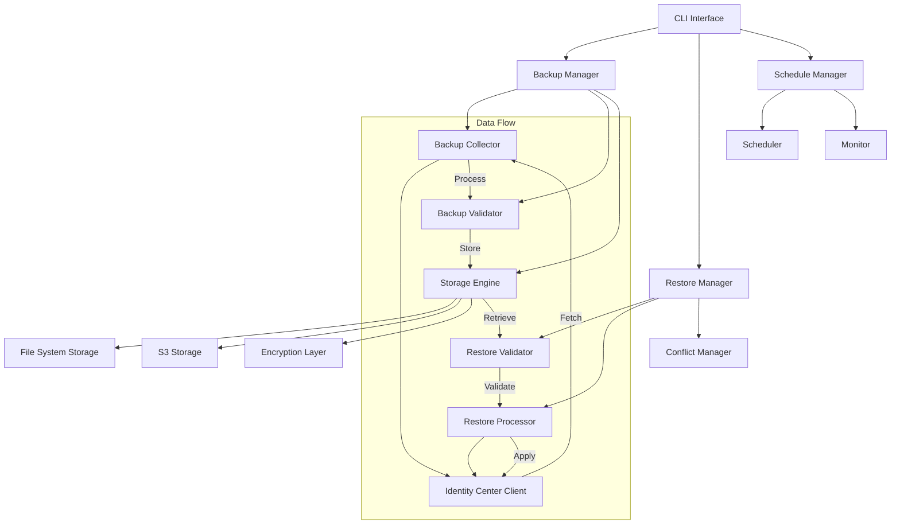

# Backup-Restore Feature - Design Document

## Overview

The Backup-Restore feature provides comprehensive backup and restore capabilities for AWS Identity Center configurations. The system enables administrators to create reliable backups of all Identity Center resources (users, groups, permission sets, assignments) and restore them for disaster recovery, environment migration, and compliance purposes.

The design follows a modular architecture with separate components for backup operations, restore operations, storage management, and scheduling. This separation ensures maintainability, testability, and allows for independent scaling of different operations.

## Architecture

### High-Level Architecture



### Component Responsibilities

- **Backup Manager**: Orchestrates backup operations, coordinates between collector, validator, and storage
- **Restore Manager**: Manages restore operations, handles conflict resolution and validation
- **Backup Collector**: Fetches data from AWS Identity Center APIs
- **Restore Processor**: Applies restored configurations to Identity Center
- **Storage Engine**: Handles multiple storage backends with encryption
- **Schedule Manager**: Manages automated backup scheduling and monitoring

## Components and Interfaces

### Backup Manager

```python
class BackupManager:
    def create_backup(self, backup_type: BackupType, options: BackupOptions) -> BackupResult
    def list_backups(self, filters: BackupFilters) -> List[BackupMetadata]
    def validate_backup(self, backup_id: str) -> ValidationResult
    def delete_backup(self, backup_id: str) -> bool
```

**Design Decision**: The BackupManager serves as the primary orchestrator to ensure consistent backup operations and centralized error handling. This design allows for easy extension of backup types and validation rules.

### Restore Manager

```python
class RestoreManager:
    def restore_backup(self, backup_id: str, options: RestoreOptions) -> RestoreResult
    def preview_restore(self, backup_id: str, options: RestoreOptions) -> RestorePreview
    def validate_compatibility(self, backup_id: str, target_env: Environment) -> CompatibilityResult
```

**Design Decision**: Separate restore manager ensures restore operations can be independently tested and optimized. The preview functionality addresses the dry-run requirement while maintaining separation of concerns.

### Storage Engine

```python
class StorageEngine:
    def store_backup(self, backup_data: BackupData, metadata: BackupMetadata) -> str
    def retrieve_backup(self, backup_id: str) -> BackupData
    def list_backups(self, filters: BackupFilters) -> List[BackupMetadata]
    def delete_backup(self, backup_id: str) -> bool
    def verify_integrity(self, backup_id: str) -> IntegrityResult
```

**Design Decision**: Abstracted storage layer supports multiple backends (filesystem, S3) with consistent interface. This design enables easy addition of new storage types and ensures backup portability.

### Data Collector

```python
class IdentityCenterCollector:
    def collect_users(self, options: CollectionOptions) -> List[User]
    def collect_groups(self, options: CollectionOptions) -> List[Group]
    def collect_permission_sets(self, options: CollectionOptions) -> List[PermissionSet]
    def collect_assignments(self, options: CollectionOptions) -> List[Assignment]
    def collect_incremental(self, since: datetime, options: CollectionOptions) -> IncrementalData
```

**Design Decision**: Separate collection methods for each resource type allow for selective backups and better error isolation. Incremental collection support addresses performance requirements for large environments.

### Export/Import Manager

```python
class ExportImportManager:
    def export_backup(self, backup_id: str, format: ExportFormat, target: ExportTarget) -> ExportResult
    def import_backup(self, source: ImportSource, format: ImportFormat, options: ImportOptions) -> ImportResult
    def validate_import_format(self, source: ImportSource, format: ImportFormat) -> ValidationResult
    def convert_format(self, data: BackupData, from_format: ExportFormat, to_format: ExportFormat) -> ConvertResult
```

**Design Decision**: Dedicated export/import manager handles format conversions and external system integration. This addresses requirement 8 for standard format support and data portability while maintaining separation of concerns.

### Schedule Manager

```python
class ScheduleManager:
    def create_schedule(self, schedule_config: ScheduleConfig) -> str
    def update_schedule(self, schedule_id: str, config: ScheduleConfig) -> bool
    def delete_schedule(self, schedule_id: str) -> bool
    def list_schedules(self) -> List[ScheduleInfo]
    def execute_scheduled_backup(self, schedule_id: str) -> BackupResult
    def get_schedule_status(self, schedule_id: str) -> ScheduleStatus
```

**Design Decision**: Separate schedule manager enables automated backup operations with configurable intervals. This addresses requirement 4 for automated scheduling while providing monitoring and management capabilities.

## Data Models

### Backup Data Structure

```python
@dataclass
class BackupData:
    metadata: BackupMetadata
    users: List[UserData]
    groups: List[GroupData]
    permission_sets: List[PermissionSetData]
    assignments: List[AssignmentData]
    relationships: RelationshipMap
    checksums: Dict[str, str]

@dataclass
class BackupMetadata:
    backup_id: str
    timestamp: datetime
    instance_arn: str
    backup_type: BackupType  # FULL, INCREMENTAL
    version: str
    source_account: str
    source_region: str
    retention_policy: RetentionPolicy
    encryption_info: EncryptionMetadata
```

**Design Decision**: Structured data model with explicit relationships ensures data integrity and supports selective restore operations. Checksums at multiple levels enable granular integrity verification.

### Restore Configuration

```python
@dataclass
class RestoreOptions:
    target_resources: List[ResourceType]  # Selective restore
    conflict_strategy: ConflictStrategy  # OVERWRITE, SKIP, PROMPT, MERGE
    dry_run: bool
    target_account: Optional[str]
    target_region: Optional[str]
    resource_mappings: Dict[str, str]  # For cross-account/region restore

@dataclass
class RestorePreview:
    changes_summary: Dict[str, int]  # Resource type -> count of changes
    conflicts: List[ConflictInfo]
    warnings: List[str]
    estimated_duration: timedelta
```

**Design Decision**: Comprehensive restore options support all requirements including selective restore, conflict resolution, and cross-account operations while maintaining type safety.

### Export/Import Data Models

```python
@dataclass
class ExportFormat:
    format_type: str  # JSON, YAML, CSV
    compression: Optional[str]  # gzip, zip
    encryption: bool

@dataclass
class ExportTarget:
    target_type: str  # filesystem, s3
    location: str
    credentials: Optional[Dict[str, str]]

@dataclass
class ImportSource:
    source_type: str  # filesystem, s3, url
    location: str
    credentials: Optional[Dict[str, str]]
```

**Design Decision**: Flexible export/import models support multiple formats and storage targets as required by requirement 8 and 9, enabling data portability and integration with external systems.

### Schedule Configuration

```python
@dataclass
class ScheduleConfig:
    name: str
    backup_type: BackupType
    interval: str  # cron expression or predefined (daily, weekly, monthly)
    retention_policy: RetentionPolicy
    notification_settings: NotificationSettings
    enabled: bool

@dataclass
class RetentionPolicy:
    keep_daily: int
    keep_weekly: int
    keep_monthly: int
    keep_yearly: int
    auto_cleanup: bool
```

**Design Decision**: Flexible scheduling configuration supports requirement 4 for automated backups with configurable intervals and retention policies for compliance requirements.

## Error Handling

### Backup Error Handling

1. **Partial Backup Recovery**: If some resources fail to backup, continue with others and report partial success
2. **API Rate Limiting**: Implement exponential backoff and retry logic for AWS API calls
3. **Storage Failures**: Support multiple storage targets with fallback mechanisms
4. **Validation Failures**: Provide detailed error reports with suggested remediation

### Restore Error Handling

1. **Compatibility Validation**: Pre-validate backup compatibility before starting restore
2. **Conflict Resolution**: Implement configurable strategies for handling resource conflicts
3. **Rollback Capability**: Support rollback of partial restore operations
4. **Cross-Account Errors**: Provide clear error messages for permission and access issues

**Design Decision**: Comprehensive error handling with recovery options ensures system reliability and provides administrators with actionable information for troubleshooting.

## Testing Strategy

### Unit Testing
- Test each component in isolation with mocked dependencies
- Validate data models and serialization/deserialization
- Test error handling scenarios and edge cases
- Verify encryption and decryption operations

### Integration Testing
- Test backup and restore workflows end-to-end
- Validate storage backend integrations
- Test cross-account and cross-region operations
- Verify scheduling and monitoring functionality

### Performance Testing
- Test backup performance with large datasets
- Validate incremental backup efficiency
- Test concurrent backup and restore operations
- Measure storage and retrieval performance

### Security Testing
- Validate encryption at rest and in transit
- Test access control and authentication
- Verify audit logging completeness
- Test secure deletion of backup data

**Design Decision**: Comprehensive testing strategy ensures reliability and security of backup operations, with particular focus on data integrity and security requirements.

## Security Considerations

### Encryption
- **At Rest**: All backup data encrypted using AES-256 with customer-managed keys
- **In Transit**: TLS 1.3 for all network communications
- **Key Management**: Integration with AWS KMS for key rotation and management

### Access Control
- **Role-Based Access**: Integration with existing RBAC system
- **Audit Logging**: Comprehensive logging of all backup and restore operations
- **Secure Storage**: Backup files stored with restricted permissions

### Data Protection
- **Sensitive Data Handling**: PII and credentials encrypted with additional protection
- **Secure Deletion**: Cryptographic erasure for backup cleanup
- **Cross-Account Security**: Strict validation of cross-account permissions

**Design Decision**: Multi-layered security approach addresses all security requirements while maintaining usability and performance.

## Performance Optimizations

### Backup Performance
- **Parallel Collection**: Concurrent API calls for different resource types
- **Incremental Backups**: Only backup changed resources to reduce time and storage
- **Compression**: Backup data compression to reduce storage requirements
- **Streaming**: Stream large datasets to avoid memory constraints

### Restore Performance
- **Batch Operations**: Group similar operations for efficient API usage
- **Parallel Processing**: Concurrent restore operations where dependencies allow
- **Progress Tracking**: Real-time progress reporting for long-running operations

### Storage Optimizations
- **Deduplication**: Identify and eliminate duplicate data across backups
- **Tiered Storage**: Move older backups to cheaper storage tiers
- **Cleanup Automation**: Automated cleanup based on retention policies

**Design Decision**: Performance optimizations focus on scalability and efficiency while maintaining data integrity and security requirements.

## Monitoring and Observability

### Metrics
- Backup success/failure rates
- Backup duration and size metrics
- Storage utilization and growth trends
- Restore operation success rates

### Alerting
- Failed backup operations
- Storage capacity warnings
- Backup integrity validation failures
- Scheduled backup missed executions

### Logging
- Detailed operation logs for troubleshooting
- Audit trails for compliance requirements
- Performance metrics for optimization
- Security events for monitoring

**Design Decision**: Comprehensive monitoring ensures operational visibility and supports proactive maintenance and troubleshooting.
