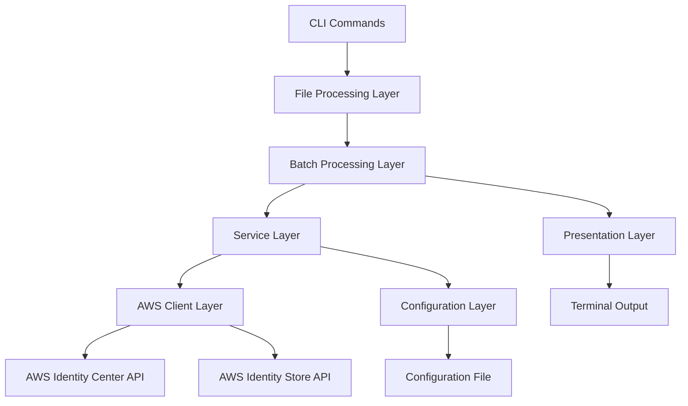

# Design Document: Bulk Operations for awsideman CLI

## Overview

The Bulk Operations feature extends the awsideman CLI to provide commands for performing bulk permission set assignments using input files. This design document outlines the architecture, components, interfaces, data models, error handling, and testing strategy for implementing bulk assignment operations.

The feature will follow the existing patterns established in the awsideman CLI, using Typer for command-line interface, boto3 for AWS API interactions, and Rich for terminal output formatting. The implementation will maintain consistency with the existing profile, SSO, user, and assignment commands to provide a seamless user experience.

This feature addresses the need for efficient bulk management of permission set assignments, supporting both CSV and JSON input formats to accommodate different administrative workflows and data sources.

## Architecture

The Bulk Operations feature will be implemented as a new command group in the awsideman CLI. The architecture follows the existing pattern with additional components for file processing and batch operations:

1. **Command Layer**: Defines the CLI commands, arguments, and options using Typer.
2. **File Processing Layer**: Handles parsing and validation of CSV and JSON input files.
3. **Batch Processing Layer**: Manages bulk operations with progress tracking and error handling.
4. **Service Layer**: Handles the business logic and interacts with the AWS API.
5. **Client Layer**: Manages AWS API clients and handles API interactions.
6. **Configuration Layer**: Manages profile and SSO instance configuration.
7. **Presentation Layer**: Formats and displays output using Rich.



The bulk operations feature requires interaction with both the AWS Identity Center (SSO Admin) API for assignment operations and the Identity Store API for principal validation.

## Components and Interfaces

### 1. Bulk Command Group

A new command group will be added to the awsideman CLI for bulk operations:

```python
# awsideman/commands/bulk.py
import typer
from typing import Optional, List, Dict, Any
from pathlib import Path
from rich.console import Console
from rich.table import Table
from rich.progress import Progress, TaskID

from ..utils.config import Config
from ..utils.aws_client import AWSClientManager

app = typer.Typer(help="Perform bulk operations for permission set assignments.")
console = Console()
config = Config()
```

### 2. Command Implementations

#### 2.1 Bulk Assign Command

```python
@app.command("assign")
def bulk_assign(
    input_file: Path = typer.Argument(..., help="Input file (CSV or JSON) containing assignment data"),
    dry_run: bool = typer.Option(False, "--dry-run", help="Validate input without making changes"),
    continue_on_error: bool = typer.Option(True, "--continue-on-error/--stop-on-error", help="Continue processing on individual failures"),
    batch_size: int = typer.Option(10, "--batch-size", help="Number of assignments to process in parallel"),
    profile: Optional[str] = typer.Option(None, "--profile", help="AWS profile to use"),
):
    """Bulk assign permission sets from input file."""
```

#### 2.2 Bulk Revoke Command

```python
@app.command("revoke")
def bulk_revoke(
    input_file: Path = typer.Argument(..., help="Input file (CSV or JSON) containing assignment data"),
    dry_run: bool = typer.Option(False, "--dry-run", help="Validate input without making changes"),
    continue_on_error: bool = typer.Option(True, "--continue-on-error/--stop-on-error", help="Continue processing on individual failures"),
    batch_size: int = typer.Option(10, "--batch-size", help="Number of assignments to process in parallel"),
    force: bool = typer.Option(False, "--force", "-f", help="Skip confirmation prompts"),
    profile: Optional[str] = typer.Option(None, "--profile", help="AWS profile to use"),
):
    """Bulk revoke permission sets from input file."""
```

### 3. File Processing Components

#### 3.1 CSV Parser

```python
class CSVProcessor:
    """Handles CSV file parsing and validation for bulk operations."""
    
    def __init__(self, file_path: Path):
        self.file_path = file_path
        self.required_columns = ['principal_name', 'permission_set_name', 'account_name']
        self.optional_columns = ['principal_type', 'account_id', 'permission_set_arn', 'principal_id']
    
    def validate_format(self) -> List[str]:
        """Validate CSV format and return list of validation errors."""
    
    def parse_assignments(self) -> List[Dict[str, Any]]:
        """Parse CSV file and return list of assignment dictionaries."""
```

#### 3.2 JSON Parser

```python
class JSONProcessor:
    """Handles JSON file parsing and validation for bulk operations."""
    
    def __init__(self, file_path: Path):
        self.file_path = file_path
        self.schema = {
            "type": "object",
            "properties": {
                "assignments": {
                    "type": "array",
                    "items": {
                        "type": "object",
                        "required": ["principal_name", "permission_set_name", "account_name"],
                        "properties": {
                            "principal_name": {"type": "string"},
                            "permission_set_name": {"type": "string"},
                            "account_name": {"type": "string"},
                            "principal_type": {"type": "string", "enum": ["USER", "GROUP"]},
                            "account_id": {"type": "string"},
                            "permission_set_arn": {"type": "string"},
                            "principal_id": {"type": "string"}
                        }
                    }
                }
            },
            "required": ["assignments"]
        }
    
    def validate_format(self) -> List[str]:
        """Validate JSON format and schema, return list of validation errors."""
    
    def parse_assignments(self) -> List[Dict[str, Any]]:
        """Parse JSON file and return list of assignment dictionaries."""
```

### 4. Batch Processing Components

#### 4.1 Batch Processor

```python
class BatchProcessor:
    """Handles batch processing of assignments with progress tracking."""
    
    def __init__(self, aws_client_manager: AWSClientManager, batch_size: int = 10):
        self.aws_client_manager = aws_client_manager
        self.batch_size = batch_size
        self.results = {
            'successful': [],
            'failed': [],
            'skipped': []
        }
    
    async def process_assignments(
        self, 
        assignments: List[Dict[str, Any]], 
        operation: str,
        dry_run: bool = False,
        continue_on_error: bool = True
    ) -> Dict[str, List]:
        """Process assignments in batches with progress tracking."""
```

#### 4.2 Resource Resolver

```python
class ResourceResolver:
    """Resolves human-readable names to AWS resource identifiers."""
    
    def __init__(self, identity_store_client, sso_admin_client, instance_arn: str, identity_store_id: str):
        self.identity_store_client = identity_store_client
        self.sso_admin_client = sso_admin_client
        self.instance_arn = instance_arn
        self.identity_store_id = identity_store_id
        self._principal_cache = {}
        self._permission_set_cache = {}
        self._account_cache = {}
    
    def resolve_principal_name(self, principal_name: str, principal_type: str) -> Optional[str]:
        """Resolve principal name to principal ID."""
    
    def resolve_permission_set_name(self, permission_set_name: str) -> Optional[str]:
        """Resolve permission set name to permission set ARN."""
    
    def resolve_account_name(self, account_name: str) -> Optional[str]:
        """Resolve account name to account ID."""
    
    def resolve_assignment(self, assignment: Dict[str, Any]) -> Dict[str, Any]:
        """Resolve all names in assignment to IDs/ARNs."""

#### 4.3 Assignment Validator

```python
class AssignmentValidator:
    """Validates individual assignments against AWS resources."""
    
    def __init__(self, identity_store_client, sso_admin_client, instance_arn: str, identity_store_id: str):
        self.identity_store_client = identity_store_client
        self.sso_admin_client = sso_admin_client
        self.instance_arn = instance_arn
        self.identity_store_id = identity_store_id
    
    def validate_assignment(self, assignment: Dict[str, Any]) -> List[str]:
        """Validate a single assignment and return list of validation errors."""
    
    def validate_principal(self, principal_id: str, principal_type: str) -> bool:
        """Validate that principal exists in Identity Store."""
    
    def validate_permission_set(self, permission_set_arn: str) -> bool:
        """Validate that permission set exists."""
```

### 5. Progress and Reporting Components

#### 5.1 Progress Tracker

```python
class ProgressTracker:
    """Manages progress display for bulk operations."""
    
    def __init__(self, console: Console):
        self.console = console
        self.progress = None
        self.task_id = None
    
    def start_progress(self, total: int, description: str):
        """Start progress tracking."""
    
    def update_progress(self, completed: int):
        """Update progress counter."""
    
    def finish_progress(self):
        """Complete progress tracking."""
```

#### 5.2 Report Generator

```python
class ReportGenerator:
    """Generates summary reports for bulk operations."""
    
    def __init__(self, console: Console):
        self.console = console
    
    def generate_summary_report(self, results: Dict[str, List], operation: str):
        """Generate and display summary report."""
    
    def generate_detailed_report(self, results: Dict[str, List], output_file: Optional[Path] = None):
        """Generate detailed report with individual assignment results."""
```

### 6. CLI Integration

The bulk command group will be integrated into the main CLI in `cli.py`:

```python
# awsideman/cli.py
from .commands import profile, sso, user, assignment, bulk

app = typer.Typer(
    help="AWS Identity Center Manager - A CLI tool for managing AWS Identity Center operations."
)

# Add subcommands
app.add_typer(profile.app, name="profile")
app.add_typer(sso.app, name="sso")
app.add_typer(user.app, name="user")
app.add_typer(assignment.app, name="assignment")
app.add_typer(bulk.app, name="bulk")
```

## Data Models

### Input File Formats

#### CSV Format

The CSV format will support the following columns:

**Required Columns:**
- `principal_name`: Name of the user or group (human-readable identifier)
- `permission_set_name`: Name of the permission set (human-readable identifier)
- `account_name`: Name of the AWS account (human-readable identifier)

**Optional Columns:**
- `principal_type`: Type of principal (USER or GROUP, defaults to USER)
- `account_id`: AWS account ID (for advanced use cases, will be resolved from name if not provided)
- `permission_set_arn`: ARN of the permission set (for advanced use cases)
- `principal_id`: ID of the user or group (for reference only, will be resolved from name)

**Example CSV:**
```csv
principal_name,permission_set_name,account_name,principal_type
john.doe,ReadOnlyAccess,Production,USER
Developers,PowerUserAccess,Development,GROUP
```

#### JSON Format

The JSON format will support a structured format with an assignments array:

```json
{
  "assignments": [
    {
      "principal_name": "john.doe",
      "permission_set_name": "ReadOnlyAccess",
      "account_name": "Production",
      "principal_type": "USER"
    },
    {
      "principal_name": "Developers",
      "permission_set_name": "PowerUserAccess",
      "account_name": "Development",
      "principal_type": "GROUP"
    }
  ]
}
```

### Processing Results Model

```python
@dataclass
class AssignmentResult:
    """Result of a single assignment operation."""
    principal_name: str
    permission_set_name: str
    account_name: str
    principal_type: str
    status: str  # 'success', 'failed', 'skipped'
    error_message: Optional[str] = None
    principal_id: Optional[str] = None
    permission_set_arn: Optional[str] = None
    account_id: Optional[str] = None

@dataclass
class BulkOperationResults:
    """Results of a bulk operation."""
    total_processed: int
    successful: List[AssignmentResult]
    failed: List[AssignmentResult]
    skipped: List[AssignmentResult]
    operation_type: str  # 'assign' or 'revoke'
    duration: float
```

## Error Handling

The Bulk Operations feature will handle the following error scenarios:

### File-Level Errors

1. **File Not Found**: If the input file doesn't exist, display clear error message with file path.
2. **Invalid File Format**: If the file format is not CSV or JSON, display format requirements.
3. **Malformed CSV**: If CSV has missing headers or invalid structure, display specific validation errors.
4. **Invalid JSON**: If JSON is malformed or doesn't match schema, display detailed validation errors.
5. **Empty File**: If the input file contains no assignments, display appropriate message.

### Assignment-Level Errors

1. **Missing Required Fields**: If required fields are missing, log error and continue with next assignment.
2. **Invalid Principal**: If principal name cannot be resolved to a principal ID, log error with principal details.
3. **Invalid Permission Set**: If permission set name cannot be resolved to an ARN, log error with permission set details.
4. **Invalid Account**: If account name cannot be resolved to an account ID, log error with account details.
5. **Assignment Already Exists**: For assign operations, log warning and continue.
6. **Assignment Doesn't Exist**: For revoke operations, log warning and continue.
7. **API Rate Limiting**: Implement exponential backoff and retry logic.
8. **Insufficient Permissions**: Log error with specific permission requirements.

### System-Level Errors

1. **Missing Profile**: Display error with profile setup guidance.
2. **Invalid Profile**: Display error with available profiles.
3. **Missing SSO Instance**: Display error with SSO configuration guidance.
4. **Network Errors**: Implement retry logic with clear error messages.
5. **AWS Service Errors**: Handle and display AWS-specific error messages.

Error handling will follow the existing pattern in the awsideman CLI, using try-except blocks and displaying error messages using Rich with appropriate styling and color coding.

## Testing Strategy

The Bulk Operations feature will be tested using the following approaches:

### Unit Tests

Unit tests will be written for each component to verify that:

1. **File Processors**: Correctly parse valid CSV and JSON files, properly validate file formats, and handle malformed input files.
2. **Assignment Validator**: Correctly validate principals, permission sets, and accounts against AWS APIs.
3. **Batch Processor**: Correctly process assignments in batches, handle errors appropriately, and maintain accurate result tracking.
4. **Progress Tracker**: Correctly display progress information and handle progress updates.
5. **Report Generator**: Generate accurate summary and detailed reports.

### Integration Tests

Integration tests will be written to verify that:

1. **End-to-End Processing**: Complete workflow from file input to final report generation.
2. **AWS API Integration**: Correct interaction with Identity Center and Identity Store APIs.
3. **Error Handling**: Proper handling of various error scenarios with appropriate user feedback.
4. **Batch Processing**: Correct parallel processing of assignments with proper error isolation.
5. **File Format Support**: Both CSV and JSON formats work correctly with various input structures.

### Manual Testing

Manual testing will be performed to verify that:

1. **User Experience**: Commands provide clear feedback and intuitive operation.
2. **Progress Display**: Progress indicators work correctly for different batch sizes.
3. **Error Messages**: Error messages are clear, actionable, and properly formatted.
4. **Report Output**: Summary and detailed reports provide useful information.
5. **Performance**: Bulk operations perform efficiently with large input files.

## Implementation Considerations

### Performance Optimization

1. **Parallel Processing**: Process assignments in parallel batches to improve throughput while respecting API rate limits.
2. **Connection Pooling**: Reuse AWS client connections across batch operations.
3. **Resolution Caching**: Cache resolution results for repeated principal names, permission set names, and account names within a single operation.
4. **Memory Management**: Process large files in chunks to avoid memory issues.

### AWS API Rate Limiting

1. **Exponential Backoff**: Implement exponential backoff for rate-limited API calls.
2. **Batch Size Tuning**: Allow users to adjust batch size based on their API limits.
3. **Progress Throttling**: Update progress display efficiently without impacting performance.

### File Processing Design Decisions

1. **Format Detection**: Automatically detect file format based on file extension (.csv, .json).
2. **Flexible CSV Headers**: Support both snake_case and kebab-case column headers.
3. **Schema Validation**: Use JSON Schema for comprehensive JSON validation.
4. **Error Accumulation**: Collect all validation errors before displaying to user.

### User Experience Considerations

1. **Dry Run Mode**: Allow users to validate input files without making changes.
2. **Interactive Confirmation**: Provide clear confirmation prompts for bulk operations.
3. **Progress Visibility**: Show real-time progress with estimated completion times.
4. **Detailed Reporting**: Provide both summary and detailed reports for operation results.
5. **Resume Capability**: Consider implementing resume functionality for interrupted operations.

### Security Considerations

1. **Input Validation**: Thoroughly validate all input data to prevent injection attacks.
2. **File Permissions**: Verify file permissions before processing.
3. **Credential Handling**: Follow existing patterns for secure AWS credential management.
4. **Audit Logging**: Log all bulk operations for audit purposes.

### Consistency with Existing Commands

1. **Parameter Naming**: Use consistent parameter names across all commands (--profile, --dry-run, etc.).
2. **Error Formatting**: Follow existing error message formatting and styling patterns.
3. **Help Text**: Maintain consistent help text structure and content style.
4. **Output Formatting**: Use Rich formatting consistent with other commands.
5. **Configuration Handling**: Follow existing patterns for profile and SSO instance validation.

### Extensibility Considerations

1. **Plugin Architecture**: Design file processors to be easily extensible for additional formats.
2. **Operation Types**: Structure batch processor to support future bulk operations beyond assignments.
3. **Custom Validators**: Allow for custom validation rules based on organizational requirements.
4. **Report Formats**: Design report generator to support multiple output formats (console, JSON, CSV).