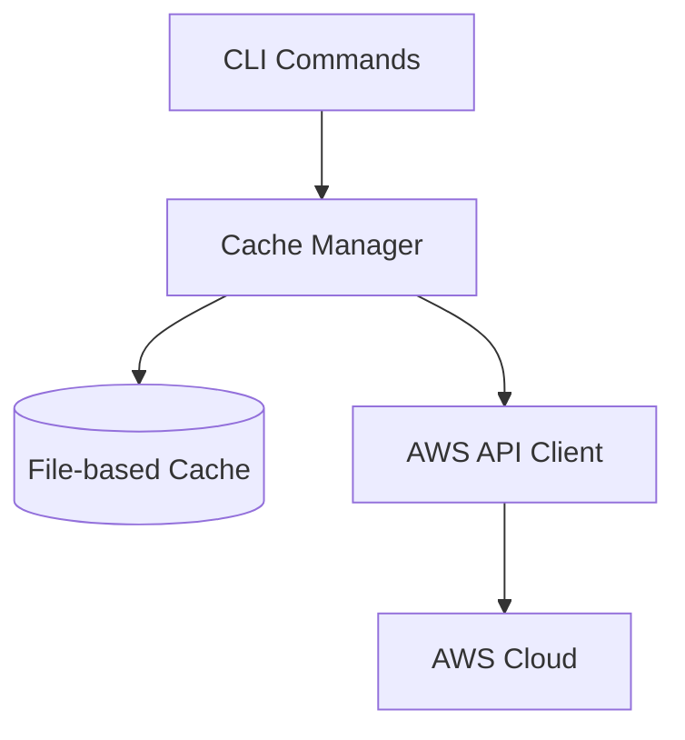

# Cache Layer Design Document

## Overview

The cache layer is designed as a transparent, configurable caching system that sits between the CLI commands and AWS API calls. It implements an intelligent caching strategy with automatic invalidation, configurable TTL policies, and resilient fallback mechanisms to improve performance while maintaining data consistency.

The design follows a layered architecture where the cache acts as a middleware component, intercepting API calls and managing cached responses without requiring changes to existing command implementations.

## Architecture

### High-Level Architecture



The cache layer sits between the CLI commands and the AWS API client. When a command is executed:

1. The Cache Manager checks if a valid (non-expired) cached response exists
2. If valid cache exists, it returns the cached data
3. If no valid cache exists, it forwards the request to the AWS API client
4. The response from AWS is then cached before being returned to the command

### Components and Interfaces

#### CacheManager

The core component responsible for managing cache operations:

```python
class CacheManager:
    def get(self, key: str) -> Optional[Dict]:
        """Retrieve data from cache if it exists and is not expired"""
        
    def set(self, key: str, data: Dict, ttl: Optional[int] = None) -> None:
        """Store data in cache with optional TTL override"""
        
    def invalidate(self, key: str = None) -> None:
        """Invalidate specific cache entry or all entries if key is None"""
        
    def _is_expired(self, entry: Dict) -> bool:
        """Check if cache entry has expired based on TTL"""
```

#### Cache Storage

The cache will be implemented using a file-based storage system:

- Cache directory: `~/.awsideman/cache/`
- File format: JSON files with metadata including creation timestamp and TTL
- Each cache entry will be stored in a separate file named using a hash of the request parameters

#### AWS API Client Wrapper

A wrapper around the existing AWS client that integrates with the cache manager:

```python
class CachedAwsClient:
    def __init__(self, cache_manager: CacheManager):
        self.cache_manager = cache_manager
        self.aws_client = AwsClient()  # Original AWS client
        
    def execute(self, operation: str, params: Dict) -> Dict:
        """Execute AWS operation with caching"""
        cache_key = self._generate_cache_key(operation, params)
        
        # Try to get from cache
        cached_result = self.cache_manager.get(cache_key)
        if cached_result:
            return cached_result
            
        # If not in cache, call AWS API
        result = self.aws_client.execute(operation, params)
        
        # Cache the result if it's a read operation
        if self._is_cacheable_operation(operation):
            self.cache_manager.set(cache_key, result)
            
        return result
```

#### CLI Cache Commands

New CLI commands for cache management:

- `awsideman cache clear`: Clears all cache entries
- `awsideman cache status`: Shows cache statistics and entry information

## Data Models

### Cache Entry

```python
@dataclass
class CacheEntry:
    data: Dict  # The actual cached data
    created_at: float  # Timestamp when entry was created
    ttl: int  # Time-to-live in seconds
    key: str  # Cache key
    operation: str  # AWS operation that generated this data
```

### Cache Configuration

```python
@dataclass
class CacheConfig:
    enabled: bool = True  # Whether caching is enabled
    default_ttl: int = 3600  # Default TTL in seconds (1 hour)
    operation_ttls: Dict[str, int] = field(default_factory=dict)  # Operation-specific TTLs
    max_size_mb: int = 100  # Maximum cache size in MB
```

## Error Handling

The cache layer implements robust error handling to ensure CLI operations continue even if the cache system encounters issues:

1. **Cache Read Errors**: If a cache file is corrupted or unreadable, it will be treated as a cache miss and logged
2. **Cache Write Errors**: If writing to cache fails, the operation will continue without caching but log the error
3. **Cache Directory Issues**: If the cache directory cannot be created or accessed, caching will be disabled temporarily

Error handling follows a fail-open approach, ensuring that cache issues never prevent successful API operations.

## Testing Strategy

The testing strategy for the cache layer includes:

1. **Unit Tests**:
   - Test CacheManager methods (get, set, invalidate)
   - Test TTL expiration logic
   - Test cache key generation
   - Test file operations with mocked file system

2. **Integration Tests**:
   - Test CachedAwsClient with mocked AWS responses
   - Test cache commands (clear, status)
   - Test configuration loading and application

3. **End-to-End Tests**:
   - Test actual CLI commands with caching enabled
   - Verify performance improvements with cached responses

## Implementation Considerations

### Cache Key Generation

Cache keys will be generated using a deterministic hash function based on:
- Operation name
- Normalized request parameters (sorted to ensure consistency)
- Instance identity (to avoid conflicts between different installations)

### TTL Configuration

TTL values will be configurable through:
1. Configuration file: `~/.awsideman/config.yaml` with a `cache` section
2. Environment variables: `AWSIDEMAN_CACHE_TTL_DEFAULT`, `AWSIDEMAN_CACHE_TTL_{OPERATION}`

Default TTLs will be set based on data volatility:
- User/Group listings: 1 hour
- Permission set listings: 2 hours
- Individual resource details: 30 minutes

### Cache Invalidation

Cache entries will be invalidated:
1. Automatically when TTL expires
2. Manually via the `cache clear` command
3. Automatically when write operations are performed on related resources

### Performance Considerations

- The cache implementation will use asynchronous writes to avoid adding latency to CLI operations
- Cache reads will be optimized for fast retrieval
- Cache size will be monitored and old entries purged if the cache exceeds configured size limits