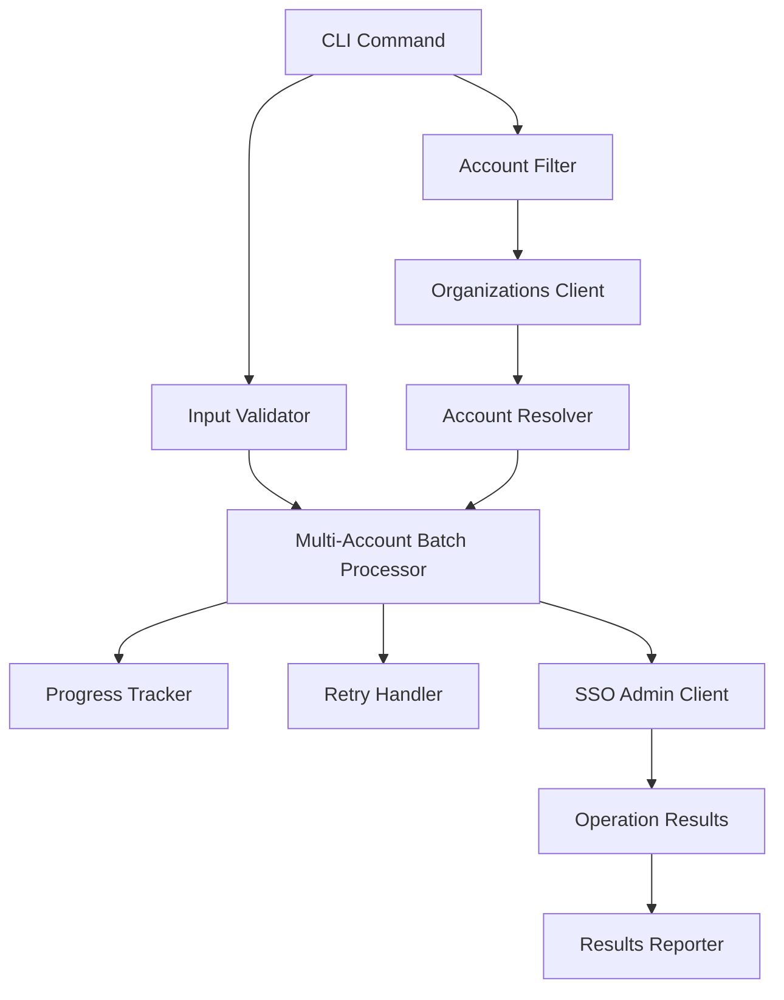

# Design Document

## Overview

The multi-account feature extends awsideman's existing assignment capabilities to support bulk operations across multiple AWS accounts in a single command. This feature builds upon the existing bulk operations infrastructure while adding account filtering, progress tracking, and batch processing capabilities specifically designed for multi-account scenarios.

The design leverages the existing architecture components including:
- AWS client management and caching
- Bulk operations utilities (batch processing, progress tracking, error handling)
- Resource resolution and validation
- Rich terminal output and user interaction

## Architecture

### High-Level Architecture



### Component Integration

The multi-account feature integrates with existing components:

1. **CLI Layer**: Extends the existing `assignment` command group with new multi-account subcommands
2. **Validation Layer**: Reuses existing validation utilities with multi-account specific extensions
3. **Processing Layer**: Builds upon existing batch processing with account-aware operations
4. **Client Layer**: Leverages existing AWS client management with Organizations API integration
5. **Reporting Layer**: Extends existing reporting with multi-account specific metrics

## Components and Interfaces

### 1. CLI Commands

**New Commands Structure:**
```
awsideman assignment multi-assign <permission-set-name> <principal-name> [OPTIONS]
awsideman assignment multi-revoke <permission-set-name> <principal-name> [OPTIONS]
```

**Command Interface:**
```python
@app.command("multi-assign")
def multi_assign_permission_set(
    permission_set_name: str,
    principal_name: str,
    account_filter: str = typer.Option(..., "--filter", help="Account filter (* or tag:Key=Value)"),
    principal_type: str = typer.Option("USER", "--principal-type"),
    dry_run: bool = typer.Option(False, "--dry-run"),
    batch_size: int = typer.Option(10, "--batch-size"),
    profile: Optional[str] = typer.Option(None, "--profile")
)
```

### 2. Account Filter Component

**AccountFilter Class:**
```python
class AccountFilter:
    def __init__(self, filter_expression: str, organizations_client: OrganizationsClientWrapper):
        self.filter_expression = filter_expression
        self.organizations_client = organizations_client
    
    def resolve_accounts(self) -> List[AccountInfo]
    def validate_filter(self) -> List[ValidationError]
    def get_filter_description(self) -> str
```

**Filter Types:**
- **Wildcard Filter**: `*` - matches all accounts in the organization
- **Tag Filter**: `tag:Environment=Production` - matches accounts with specific tag key-value pairs
- **Multiple Tag Filter**: Support for multiple `--filter-tag` flags

### 3. Multi-Account Batch Processor

**MultiAccountBatchProcessor Class:**
```python
class MultiAccountBatchProcessor:
    def __init__(self, aws_client_manager: AWSClientManager, batch_size: int):
        self.aws_client_manager = aws_client_manager
        self.batch_size = batch_size
        self.retry_handler = RetryHandler()
        self.progress_tracker = MultiAccountProgressTracker()
        self.resource_resolver = ResourceResolver()
    
    async def process_multi_account_operation(
        self,
        accounts: List[AccountInfo],
        permission_set_name: str,
        principal_name: str,
        principal_type: str,
        operation: str,
        instance_arn: str,
        dry_run: bool = False
    ) -> MultiAccountResults
```

### 4. Progress Tracking Enhancement

**MultiAccountProgressTracker Class:**
```python
class MultiAccountProgressTracker(ProgressTracker):
    def __init__(self, console: Console):
        super().__init__(console)
        self.current_account: Optional[str] = None
        self.account_results: Dict[str, str] = {}
    
    def update_current_account(self, account_name: str, account_id: str)
    def record_account_result(self, account_id: str, status: str, error: Optional[str] = None)
    def display_account_progress(self)
```

### 5. Results and Reporting

**MultiAccountResults Class:**
```python
@dataclass
class MultiAccountResults:
    total_accounts: int
    successful_accounts: List[AccountResult]
    failed_accounts: List[AccountResult]
    skipped_accounts: List[AccountResult]
    operation_type: str
    duration: float
    batch_size: int
    
    @property
    def success_rate(self) -> float
    def get_summary_stats(self) -> Dict[str, Any]
```

## Data Models

### Account Information Model

```python
@dataclass
class AccountInfo:
    account_id: str
    account_name: str
    email: str
    status: str
    tags: Dict[str, str]
    ou_path: List[str]
    
    def matches_tag_filter(self, tag_key: str, tag_value: str) -> bool
    def get_display_name(self) -> str
```

### Account Result Model

```python
@dataclass
class AccountResult:
    account_id: str
    account_name: str
    status: str  # 'success', 'failed', 'skipped'
    error_message: Optional[str] = None
    processing_time: float = 0.0
    retry_count: int = 0
    timestamp: Optional[float] = None
    
    def is_successful(self) -> bool
    def get_error_summary(self) -> str
```

### Multi-Account Assignment Model

```python
@dataclass
class MultiAccountAssignment:
    permission_set_name: str
    principal_name: str
    principal_type: str
    accounts: List[AccountInfo]
    operation: str  # 'assign' or 'revoke'
    
    # Resolved values (populated after name resolution)
    permission_set_arn: Optional[str] = None
    principal_id: Optional[str] = None
    
    def get_total_operations(self) -> int
    def validate(self) -> List[ValidationError]
    def resolve_names(self, resolver: ResourceResolver) -> List[ValidationError]
```

## Error Handling

### Error Categories

1. **Validation Errors**:
   - Invalid filter expressions
   - Missing required parameters
   - Invalid permission set ARN or principal ID

2. **Resolution Errors**:
   - Permission set name cannot be resolved to ARN
   - Principal name cannot be resolved to ID
   - Account filter returns no matches
   - Organizations API access denied
   - Invalid tag filter format

3. **Processing Errors**:
   - Individual account assignment failures
   - Rate limiting and throttling
   - Network connectivity issues

4. **Authorization Errors**:
   - Insufficient permissions for specific accounts
   - Cross-account access denied
   - SSO instance access issues

### Error Handling Strategy

```python
class MultiAccountErrorHandler:
    def handle_name_resolution_error(self, name: str, name_type: str, error: Exception) -> None
    def handle_account_filter_error(self, error: Exception) -> None
    def handle_assignment_error(self, account_id: str, error: Exception) -> AccountResult
    def should_continue_on_error(self, error: Exception, continue_on_error: bool) -> bool
    def format_error_summary(self, results: MultiAccountResults) -> str
```

## Testing Strategy

### Unit Tests

1. **Account Filter Tests**:
   - Wildcard filter resolution
   - Tag-based filter resolution
   - Multiple tag filter combinations
   - Invalid filter expression handling

2. **Batch Processing Tests**:
   - Multi-account assignment processing
   - Error isolation between accounts
   - Progress tracking accuracy
   - Retry logic for failed accounts

3. **Results Aggregation Tests**:
   - Success/failure counting
   - Performance metrics calculation
   - Error message aggregation

### Integration Tests

1. **End-to-End Multi-Account Tests**:
   - Complete multi-assign workflow
   - Complete multi-revoke workflow
   - Dry-run validation
   - Mixed success/failure scenarios

2. **AWS API Integration Tests**:
   - Organizations API account listing
   - SSO Admin API assignment operations
   - Rate limiting and retry behavior
   - Cross-account permission validation

### Performance Tests

1. **Scalability Tests**:
   - 100+ account operations
   - Large batch size processing
   - Memory usage with large account lists
   - Progress tracking performance

2. **Rate Limiting Tests**:
   - AWS API throttling handling
   - Exponential backoff validation
   - Concurrent request management

## Implementation Considerations

### Performance Optimizations

1. **Account Resolution Caching**:
   - Cache Organizations API responses
   - Reuse account metadata across operations
   - Implement cache invalidation strategies

2. **Batch Processing Optimization**:
   - Optimal batch size determination
   - Parallel processing within rate limits
   - Memory-efficient result aggregation

3. **Progress Tracking Efficiency**:
   - Minimal overhead progress updates
   - Efficient terminal output management
   - Real-time status display

### Security Considerations

1. **Permission Validation**:
   - Validate access to all target accounts before processing
   - Handle cross-account permission failures gracefully
   - Implement least-privilege access patterns

2. **Input Validation**:
   - Sanitize filter expressions
   - Validate account IDs and ARNs
   - Prevent injection attacks in tag filters

3. **Audit and Logging**:
   - Log all multi-account operations
   - Track permission changes across accounts
   - Maintain operation audit trails

### Backward Compatibility

1. **Existing Command Preservation**:
   - Maintain all existing assignment commands
   - No breaking changes to current interfaces
   - Preserve existing behavior and output formats

2. **Configuration Compatibility**:
   - Reuse existing AWS profile configurations
   - Maintain existing cache and client settings
   - Support existing authentication methods

### Future Extensibility

1. **Additional Filter Types**:
   - OU-based filtering
   - Account name pattern matching
   - Complex boolean filter expressions

2. **Enhanced Reporting**:
   - Export results to files
   - Integration with external monitoring
   - Custom report formats

3. **Automation Support**:
   - JSON output for programmatic use
   - Webhook notifications for completion
   - Integration with CI/CD pipelines