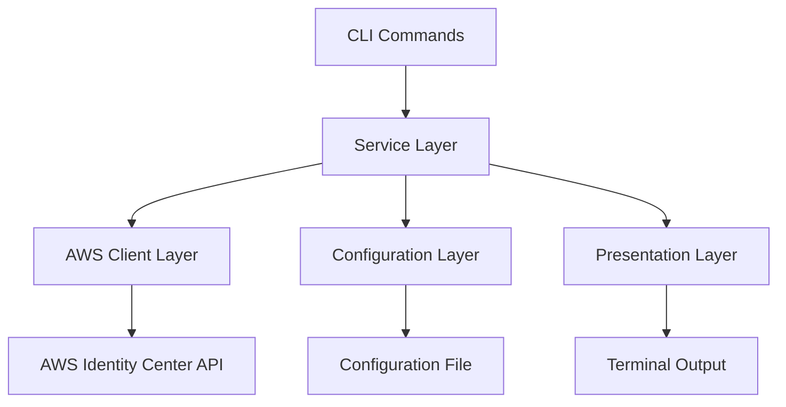

# Design Document: User Management for awsideman CLI

## Overview

The User Management feature extends the awsideman CLI to provide commands for managing users in AWS Identity Center. This design document outlines the architecture, components, interfaces, data models, error handling, and testing strategy for implementing the user management commands.

The feature will follow the existing patterns established in the awsideman CLI, using Typer for command-line interface, boto3 for AWS API interactions, and Rich for terminal output formatting. The implementation will maintain consistency with the existing profile and SSO commands to provide a seamless user experience.

## Architecture

The User Management feature will be implemented as a new command group in the awsideman CLI. The architecture follows the existing pattern:

1. **Command Layer**: Defines the CLI commands, arguments, and options using Typer.
2. **Service Layer**: Handles the business logic and interacts with the AWS API.
3. **Client Layer**: Manages AWS API clients and handles API interactions.
4. **Configuration Layer**: Manages profile and SSO instance configuration.
5. **Presentation Layer**: Formats and displays output using Rich.



## Components and Interfaces

### 1. User Command Group

A new command group will be added to the awsideman CLI for user management:

```python
# awsideman/commands/user.py
import typer
from typing import Optional
from rich.console import Console
from rich.table import Table

from ..utils.config import Config
from ..utils.aws_client import AWSClientManager

app = typer.Typer(help="Manage users in AWS Identity Center.")
console = Console()
config = Config()

# Command implementations will be added here
```

### 2. Command Implementations

#### 2.1 List Users Command

```python
@app.command("list")
def list_users(
    filter: Optional[str] = typer.Option(None, "--filter", "-f", help="Filter users by attribute"),
    limit: Optional[int] = typer.Option(None, "--limit", "-l", help="Maximum number of users to return"),
    next_token: Optional[str] = typer.Option(None, "--next-token", "-n", help="Pagination token"),
    profile: Optional[str] = typer.Option(None, "--profile", "-p", help="AWS profile to use"),
):
    """List all users in the Identity Store."""
    # Implementation details
```

#### 2.2 Get User Command

```python
@app.command("get")
def get_user(
    user_id: str = typer.Argument(..., help="User ID"),
    profile: Optional[str] = typer.Option(None, "--profile", "-p", help="AWS profile to use"),
):
    """Get details about a specific user."""
    # Implementation details
```

#### 2.3 Create User Command

```python
@app.command("create")
def create_user(
    username: str = typer.Option(..., "--username", help="Username for the new user"),
    email: str = typer.Option(..., "--email", help="Email address for the new user"),
    given_name: Optional[str] = typer.Option(None, "--given-name", help="User's first name"),
    family_name: Optional[str] = typer.Option(None, "--family-name", help="User's last name"),
    display_name: Optional[str] = typer.Option(None, "--display-name", help="Display name for the user"),
    profile: Optional[str] = typer.Option(None, "--profile", "-p", help="AWS profile to use"),
):
    """Create a new user in the Identity Store."""
    # Implementation details
```

#### 2.4 Update User Command

```python
@app.command("update")
def update_user(
    user_id: str = typer.Argument(..., help="User ID"),
    username: Optional[str] = typer.Option(None, "--username", help="Updated username"),
    email: Optional[str] = typer.Option(None, "--email", help="Updated email address"),
    given_name: Optional[str] = typer.Option(None, "--given-name", help="Updated first name"),
    family_name: Optional[str] = typer.Option(None, "--family-name", help="Updated last name"),
    display_name: Optional[str] = typer.Option(None, "--display-name", help="Updated display name"),
    profile: Optional[str] = typer.Option(None, "--profile", "-p", help="AWS profile to use"),
):
    """Update an existing user in the Identity Store."""
    # Implementation details
```

#### 2.5 Delete User Command

```python
@app.command("delete")
def delete_user(
    user_id: str = typer.Argument(..., help="User ID"),
    force: bool = typer.Option(False, "--force", "-f", help="Force deletion without confirmation"),
    profile: Optional[str] = typer.Option(None, "--profile", "-p", help="AWS profile to use"),
):
    """Delete a user from the Identity Store."""
    # Implementation details
```

### 3. AWS Client Extensions

The existing `AWSClientManager` class will be used to interact with the AWS Identity Store API. No changes are needed to the class itself, as it already provides methods for getting the Identity Store client.

### 4. CLI Integration

The user command group will be integrated into the main CLI in `cli.py`:

```python
# awsideman/cli.py
from .commands import profile, sso, user

app = typer.Typer(
    help="AWS Identity Center Manager - A CLI tool for managing AWS Identity Center operations."
)

# Add subcommands
app.add_typer(profile.app, name="profile")
app.add_typer(sso.app, name="sso")
app.add_typer(user.app, name="user")
```

## Data Models

### User Model

The User Management feature will work with the following user attributes:

- `UserId`: Unique identifier for the user
- `UserName`: Username for the user
- `Email`: Email address for the user
- `GivenName`: User's first name
- `FamilyName`: User's last name
- `DisplayName`: Display name for the user
- `Status`: User's status (ENABLED, DISABLED)

These attributes map directly to the AWS Identity Store API's user attributes.

## Error Handling

The User Management feature will handle the following error scenarios:

1. **Missing Profile**: If no profile is specified and no default profile is set, display an error message.
2. **Invalid Profile**: If the specified profile does not exist, display an error message.
3. **Missing SSO Instance**: If no SSO instance is configured for the profile, display an error message.
4. **API Errors**: Handle AWS API errors gracefully and display clear error messages.
5. **User Not Found**: If a specified user does not exist, display an appropriate error message.
6. **Duplicate User**: If a user with the same username already exists during creation, display an error message.
7. **Missing Required Parameters**: If required parameters are missing, display a helpful error message.

Error handling will follow the existing pattern in the awsideman CLI, using try-except blocks and displaying error messages using Rich.

## Testing Strategy

The User Management feature will be tested using the following approaches:

### Unit Tests

Unit tests will be written for each command implementation to verify that:

1. The command correctly handles valid inputs.
2. The command correctly handles invalid inputs.
3. The command correctly handles error scenarios.
4. The command correctly interacts with the AWS API.

### Integration Tests

Integration tests will be written to verify that:

1. The commands correctly integrate with the AWS Identity Store API.
2. The commands correctly handle pagination and filtering.
3. The commands correctly handle real-world error scenarios.

### Manual Testing

Manual testing will be performed to verify that:

1. The commands provide a good user experience.
2. The commands provide clear and helpful error messages.
3. The commands correctly handle edge cases.

## Implementation Considerations

### AWS API Pagination

The AWS Identity Store API uses pagination for list operations. The implementation will need to handle pagination correctly, both for internal use and for exposing pagination to the user through the `--next-token` option.

### Error Messages

Error messages should be clear and helpful, providing guidance on how to resolve the issue. For example, if no SSO instance is configured for the profile, the error message should suggest using the `awsideman sso set` command to configure an SSO instance.

### Output Formatting

Output will be formatted using Rich, following the existing pattern in the awsideman CLI. Tables will be used for list operations, and structured output will be used for get operations.

### Command Help

Each command will include detailed help text, accessible through the `--help` option. The help text should explain the command's purpose, arguments, and options.

### Profile Handling

All commands will accept a `--profile` option to specify the AWS profile to use. If no profile is specified, the default profile will be used. If no default profile is set, an error message will be displayed.

### SSO Instance Verification

All commands will verify that an SSO instance is configured for the profile before making API calls. If no SSO instance is configured, an error message will be displayed, suggesting to use the `awsideman sso set` command to configure an SSO instance.
