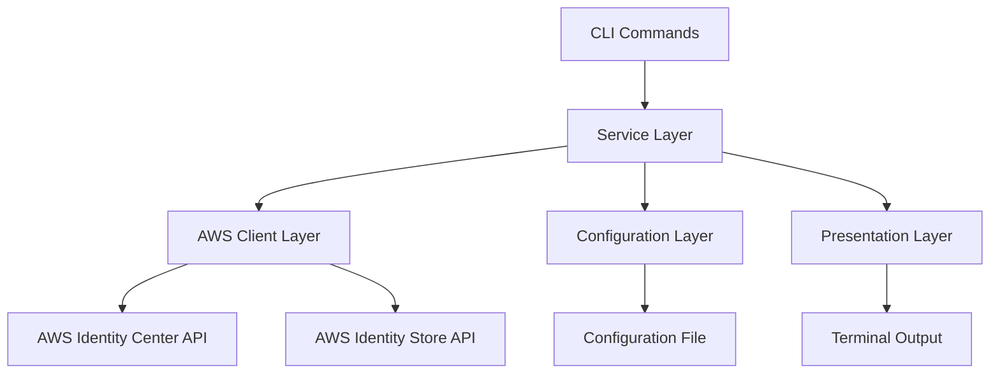

# Design Document: Assignment Management for awsideman CLI

## Overview

The Assignment Management feature extends the awsideman CLI to provide commands for managing permission set assignments in AWS Identity Center. This design document outlines the architecture, components, interfaces, data models, error handling, and testing strategy for implementing the assignment management commands.

The feature will follow the existing patterns established in the awsideman CLI, using Typer for command-line interface, boto3 for AWS API interactions, and Rich for terminal output formatting. The implementation will maintain consistency with the existing profile, SSO, and user commands to provide a seamless user experience.

Permission set assignments link permission sets to principals (users or groups) for specific AWS accounts, enabling fine-grained access control within AWS Identity Center.

## Architecture

The Assignment Management feature will be implemented as a new command group in the awsideman CLI. The architecture follows the existing pattern:

1. **Command Layer**: Defines the CLI commands, arguments, and options using Typer.
2. **Service Layer**: Handles the business logic and interacts with the AWS API.
3. **Client Layer**: Manages AWS API clients and handles API interactions.
4. **Configuration Layer**: Manages profile and SSO instance configuration.
5. **Presentation Layer**: Formats and displays output using Rich.



The assignment management feature requires interaction with both the AWS Identity Center (SSO Admin) API for permission set operations and the Identity Store API for principal information.

## Components and Interfaces

### 1. Assignment Command Group

A new command group will be added to the awsideman CLI for assignment management:

```python
# awsideman/commands/assignment.py
import typer
from typing import Optional
from rich.console import Console
from rich.table import Table

from ..utils.config import Config
from ..utils.aws_client import AWSClientManager

app = typer.Typer(help="Manage permission set assignments in AWS Identity Center.")
console = Console()
config = Config()
```

### 2. Command Implementations

#### 2.1 List Assignments Command

```python
@app.command("list")
def list_assignments(
    account_id: Optional[str] = typer.Option(None, "--account-id", "-a", help="Filter by AWS account ID"),
    permission_set_arn: Optional[str] = typer.Option(None, "--permission-set-arn", "-p", help="Filter by permission set ARN"),
    principal_id: Optional[str] = typer.Option(None, "--principal-id", help="Filter by principal ID"),
    limit: Optional[int] = typer.Option(None, "--limit", "-l", help="Maximum number of assignments to return"),
    next_token: Optional[str] = typer.Option(None, "--next-token", "-n", help="Pagination token"),
    profile: Optional[str] = typer.Option(None, "--profile", help="AWS profile to use"),
):
    """List all permission set assignments."""
```

#### 2.2 Get Assignment Command

```python
@app.command("get")
def get_assignment(
    permission_set_arn: str = typer.Argument(..., help="Permission set ARN"),
    principal_id: str = typer.Argument(..., help="Principal ID (user or group)"),
    account_id: str = typer.Argument(..., help="AWS account ID"),
    profile: Optional[str] = typer.Option(None, "--profile", help="AWS profile to use"),
):
    """Get details about a specific permission set assignment."""
```

#### 2.3 Assign Permission Set Command

```python
@app.command("assign")
def assign_permission_set(
    permission_set_arn: str = typer.Argument(..., help="Permission set ARN"),
    principal_id: str = typer.Argument(..., help="Principal ID (user or group)"),
    account_id: str = typer.Argument(..., help="AWS account ID"),
    principal_type: str = typer.Option("USER", "--principal-type", help="Principal type (USER or GROUP)"),
    profile: Optional[str] = typer.Option(None, "--profile", help="AWS profile to use"),
):
    """Assign a permission set to a principal for a specific account."""
```

#### 2.4 Revoke Assignment Command

```python
@app.command("revoke")
def revoke_assignment(
    permission_set_arn: str = typer.Argument(..., help="Permission set ARN"),
    principal_id: str = typer.Argument(..., help="Principal ID (user or group)"),
    account_id: str = typer.Argument(..., help="AWS account ID"),
    principal_type: str = typer.Option("USER", "--principal-type", help="Principal type (USER or GROUP)"),
    force: bool = typer.Option(False, "--force", "-f", help="Force revocation without confirmation"),
    profile: Optional[str] = typer.Option(None, "--profile", help="AWS profile to use"),
):
    """Revoke a permission set assignment from a principal."""
```

### 3. Helper Functions

#### 3.1 Principal Resolution

```python
def resolve_principal_info(identity_store_id: str, principal_id: str, identity_store_client) -> dict:
    """
    Resolve principal information (name, type) from principal ID.

    Args:
        identity_store_id: Identity store ID
        principal_id: Principal ID to resolve
        identity_store_client: Identity store client

    Returns:
        Dictionary containing principal information
    """
```

#### 3.2 Permission Set Resolution

```python
def resolve_permission_set_info(instance_arn: str, permission_set_arn: str, sso_admin_client) -> dict:
    """
    Resolve permission set information from ARN.

    Args:
        instance_arn: SSO instance ARN
        permission_set_arn: Permission set ARN
        sso_admin_client: SSO admin client

    Returns:
        Dictionary containing permission set information
    """
```

### 4. AWS Client Extensions

The existing `AWSClientManager` class will be used to interact with both the AWS Identity Center (SSO Admin) API and the Identity Store API. The class already provides methods for getting both clients.

### 5. CLI Integration

The assignment command group will be integrated into the main CLI in `cli.py`:

```python
# awsideman/cli.py
from .commands import profile, sso, user, assignment

app = typer.Typer(
    help="AWS Identity Center Manager - A CLI tool for managing AWS Identity Center operations."
)

# Add subcommands
app.add_typer(profile.app, name="profile")
app.add_typer(sso.app, name="sso")
app.add_typer(user.app, name="user")
app.add_typer(assignment.app, name="assignment")
```

## Data Models

### Assignment Model

The Assignment Management feature will work with the following assignment attributes:

- `PermissionSetArn`: ARN of the permission set
- `PrincipalId`: ID of the principal (user or group)
- `PrincipalType`: Type of principal (USER or GROUP)
- `TargetId`: AWS account ID where the assignment applies
- `TargetType`: Type of target (always AWS_ACCOUNT for account assignments)
- `CreatedDate`: When the assignment was created

### Enhanced Display Model

For user-friendly display, the feature will resolve and show:

- `PermissionSetName`: Human-readable name of the permission set
- `PrincipalName`: Human-readable name of the principal
- `AccountName`: Human-readable name of the AWS account (if available)

## Error Handling

The Assignment Management feature will handle the following error scenarios:

1. **Missing Profile**: If no profile is specified and no default profile is set, display an error message with guidance.
2. **Invalid Profile**: If the specified profile does not exist, display an error message.
3. **Missing SSO Instance**: If no SSO instance is configured for the profile, display an error message with setup guidance.
4. **API Errors**: Handle AWS API errors gracefully and display clear error messages.
5. **Assignment Not Found**: If a specified assignment does not exist, display an appropriate error message.
6. **Assignment Already Exists**: If an assignment already exists during creation, display an informative message.
7. **Invalid Principal**: If the specified principal ID does not exist, display an error message.
8. **Invalid Permission Set**: If the specified permission set ARN is invalid, display an error message.
9. **Invalid Account**: If the specified account ID is invalid, display an error message.
10. **Insufficient Permissions**: If the user lacks permissions for assignment operations, display a helpful error message.

Error handling will follow the existing pattern in the awsideman CLI, using try-except blocks and displaying error messages using Rich with appropriate styling.

## Testing Strategy

The Assignment Management feature will be tested using the following approaches:

### Unit Tests

Unit tests will be written for each command implementation to verify that:

1. Commands correctly handle valid inputs and parameter combinations.
2. Commands correctly validate required parameters.
3. Commands correctly handle invalid inputs and edge cases.
4. Commands correctly handle error scenarios and display appropriate messages.
5. Helper functions correctly resolve principal and permission set information.
6. API interactions are properly structured and handle responses correctly.

### Integration Tests

Integration tests will be written to verify that:

1. Commands correctly integrate with both AWS Identity Center and Identity Store APIs.
2. Commands correctly handle pagination for list operations.
3. Commands correctly handle real-world error scenarios from AWS APIs.
4. Assignment operations correctly create and remove assignments.
5. List operations correctly filter and display assignment information.

### Manual Testing

Manual testing will be performed to verify that:

1. Commands provide a good user experience with clear output formatting.
2. Commands provide clear and helpful error messages for common scenarios.
3. Commands correctly handle edge cases like non-existent principals or permission sets.
4. Interactive confirmation prompts work correctly for destructive operations.

## Implementation Considerations

### AWS API Interactions

The implementation requires interaction with multiple AWS APIs:

- **SSO Admin API**: For permission set assignment operations (`CreateAccountAssignment`, `DeleteAccountAssignment`, `ListAccountAssignments`)
- **Identity Store API**: For resolving principal information (`DescribeUser`, `DescribeGroup`)
- **Organizations API** (optional): For resolving account names

### Assignment Identification

AWS permission set assignments are identified by the combination of:
- Permission Set ARN
- Principal ID
- Principal Type
- Target Account ID

This composite key approach requires careful parameter validation and error handling.

### Pagination Handling

The `ListAccountAssignments` API supports pagination. The implementation will:
- Handle pagination internally for complete data retrieval
- Expose pagination controls to users through `--limit` and `--next-token` options
- Provide interactive pagination similar to the user list command

### Output Formatting

Output will be formatted using Rich, following the existing pattern:

- **List Command**: Tabular format showing permission set name, principal name, principal type, and target account
- **Get Command**: Detailed view with all assignment attributes and resolved names
- **Assign/Revoke Commands**: Confirmation messages with operation details

### Performance Considerations

To optimize performance when displaying assignment lists:

1. **Batch Resolution**: Resolve principal and permission set names in batches when possible
2. **Caching**: Cache resolved names within a single command execution
3. **Lazy Loading**: Only resolve additional information when displaying detailed views

### Principal Type Handling

The feature will support both USER and GROUP principals:

- Default to USER type when not specified
- Validate principal type against actual principal in Identity Store
- Provide clear error messages for type mismatches

### Confirmation Prompts

For destructive operations (revoke), implement confirmation prompts:
- Show assignment details before confirmation
- Allow bypassing with `--force` flag
- Use Rich styling for clear visual distinction

### Command Consistency

Maintain consistency with existing commands:
- Use same parameter naming conventions (`--profile`, `--limit`, etc.)
- Follow same error message formatting and styling
- Use consistent help text structure and content
- Implement same validation patterns for profiles and SSO instances
