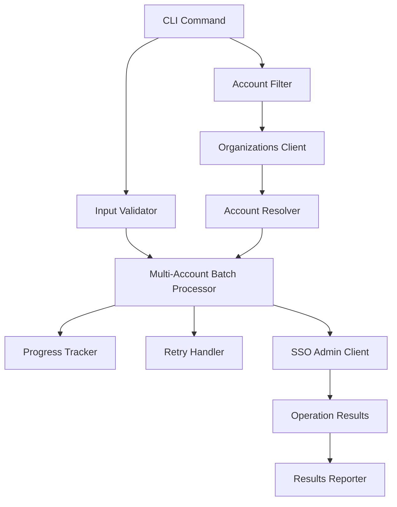

# Design Document

## Overview

The multi-account feature extends awsideman's existing assignment capabilities to support bulk operations across multiple AWS accounts in a single command. This feature builds upon the existing bulk operations infrastructure while adding account filtering, progress tracking, and batch processing capabilities specifically designed for multi-account scenarios.

The design leverages the existing architecture components including:
- AWS client management and caching
- Bulk operations utilities (batch processing, progress tracking, error handling)
- Resource resolution and validation
- Rich terminal output and user interaction

## Architecture

### High-Level Architecture



### Component Integration

The multi-account feature integrates with existing components:

1. **CLI Layer**: Extends the existing `assignment` command group with multi-account capabilities through filter options
2. **Validation Layer**: Reuses existing validation utilities with multi-account specific extensions
3. **Processing Layer**: Builds upon existing batch processing with account-aware operations
4. **Client Layer**: Leverages existing AWS client management with Organizations API integration
5. **Reporting Layer**: Extends existing reporting with multi-account specific metrics

## Components and Interfaces

### 1. CLI Commands

**Unified Command Structure:**
```
# Single account operations (existing)
awsideman assignment assign <permission-set-name> <principal-name> <account-id> [OPTIONS]
awsideman assignment revoke <permission-set-name> <principal-name> <account-id> [OPTIONS]

# Multi-account operations (new)
awsideman assignment assign <permission-set-name> <principal-name> --filter "*" [OPTIONS]
awsideman assignment assign <permission-set-name> <principal-name> --filter "tag:Environment=Production" [OPTIONS]
awsideman assignment revoke <permission-set-name> <principal-name> --filter "*" [OPTIONS]
awsideman assignment revoke <permission-set-name> <principal-name> --filter "tag:Team=DevOps" [OPTIONS]
```

**Command Interface:**
```python
@app.command("assign")
def assign_permission_set(
    permission_set_name: str,
    principal_name: str,
    account_id: Optional[str] = typer.Argument(None, help="AWS account ID (for single account assignment)"),
    account_filter: Optional[str] = typer.Option(None, "--filter", help="Account filter for multi-account assignment (* for all accounts, or tag:Key=Value for tag-based filtering)"),
    accounts: Optional[str] = typer.Option(None, "--accounts", help="Comma-separated list of account IDs for multi-account assignment"),
    ou_filter: Optional[str] = typer.Option(None, "--ou-filter", help="Organizational unit path filter (e.g., 'Root/Production')"),
    account_pattern: Optional[str] = typer.Option(None, "--account-pattern", help="Regex pattern for account name matching"),
    principal_type: str = typer.Option("USER", "--principal-type", help="Principal type (USER or GROUP)"),
    dry_run: bool = typer.Option(False, "--dry-run", help="Preview operations without making changes"),
    batch_size: int = typer.Option(10, "--batch-size", help="Number of accounts to process concurrently (for multi-account operations)"),
    continue_on_error: bool = typer.Option(True, "--continue-on-error/--stop-on-error", help="Continue processing on individual account failures (for multi-account operations)"),
    profile: Optional[str] = typer.Option(None, "--profile", help="AWS profile to use"),
)

@app.command("revoke")
def revoke_permission_set(
    permission_set_name: str,
    principal_name: str,
    account_id: Optional[str] = typer.Argument(None, help="AWS account ID (for single account revocation)"),
    account_filter: Optional[str] = typer.Option(None, "--filter", help="Account filter for multi-account revocation (* for all accounts, or tag:Key=Value for tag-based filtering)"),
    accounts: Optional[str] = typer.Option(None, "--accounts", help="Comma-separated list of account IDs for multi-account revocation"),
    ou_filter: Optional[str] = typer.Option(None, "--ou-filter", help="Organizational unit path filter (e.g., 'Root/Production')"),
    account_pattern: Optional[str] = typer.Option(None, "--account-pattern", help="Regex pattern for account name matching"),
    principal_type: str = typer.Option("USER", "--principal-type", help="Principal type (USER or GROUP)"),
    force: bool = typer.Option(False, "--force", "-f", help="Force revocation without confirmation"),
    dry_run: bool = typer.Option(False, "--dry-run", help="Preview operations without making changes"),
    batch_size: int = typer.Option(10, "--batch-size", help="Number of accounts to process concurrently (for multi-account operations)"),
    continue_on_error: bool = typer.Option(True, "--continue-on-error/--stop-on-error", help="Continue processing on individual account failures (for multi-account operations)"),
    profile: Optional[str] = typer.Option(None, "--profile", help="AWS profile to use"),
)
```

**Design Rationale**: The command interface has been unified to support both single and multi-account operations through the same commands. When `account_id` is provided, it performs a single account operation. When `--filter` or other multi-account options are provided, it performs multi-account operations. This design ensures mutual exclusivity between different filtering approaches while providing flexibility for various use cases. A required filter parameter prevents accidental bulk operations across all accounts (Requirement 3.3).

### 2. Multi-Account Operation Handlers

**Helper Functions:**
```python
def _execute_multi_account_assignment(
    permission_set_name: str,
    principal_name: str,
    account_filter: str,
    principal_type: str = "USER",
    dry_run: bool = False,
    batch_size: int = 10,
    continue_on_error: bool = True,
    profile: Optional[str] = None,
) -> None

def _execute_multi_account_revocation(
    permission_set_name: str,
    principal_name: str,
    account_filter: str,
    principal_type: str = "USER",
    force: bool = False,
    dry_run: bool = False,
    batch_size: int = 10,
    continue_on_error: bool = True,
    profile: Optional[str] = None,
) -> None
```

**Design Rationale**: These helper functions implement the multi-account logic that was previously in separate `multi-assign` and `multi-revoke` commands. They are called by the main `assign` and `revoke` commands when multi-account operations are detected. This approach maintains clean separation of concerns while providing a unified user interface.

### 3. Account Filter Component

**AccountFilter Class:**
```python
class AccountFilter:
    def __init__(self,
                 filter_expression: Optional[str] = None,
                 filter_tags: Optional[List[str]] = None,
                 explicit_accounts: Optional[List[str]] = None,
                 ou_filter: Optional[str] = None,
                 account_name_pattern: Optional[str] = None,
                 organizations_client: OrganizationsClientWrapper = None):
        self.filter_expression = filter_expression
        self.filter_tags = filter_tags or []
        self.explicit_accounts = explicit_accounts or []
        self.ou_filter = ou_filter
        self.account_name_pattern = account_name_pattern
        self.organizations_client = organizations_client

    def resolve_accounts(self) -> Generator[AccountInfo, None, None]
    def resolve_accounts_streaming(self) -> Generator[AccountInfo, None, None]
    def validate_filter(self) -> List[ValidationError]
    def get_filter_description(self) -> str
    def _validate_mutually_exclusive_filters(self) -> List[ValidationError]
    def _resolve_wildcard_accounts(self) -> Generator[AccountInfo, None, None]
    def _resolve_tag_filtered_accounts(self) -> Generator[AccountInfo, None, None]
    def _resolve_explicit_accounts(self) -> Generator[AccountInfo, None, None]
    def _resolve_ou_filtered_accounts(self) -> Generator[AccountInfo, None, None]
    def _resolve_pattern_filtered_accounts(self) -> Generator[AccountInfo, None, None]
    def _apply_boolean_filter_logic(self, accounts: Generator[AccountInfo, None, None]) -> Generator[AccountInfo, None, None]
```

**Filter Types:**
- **Wildcard Filter**: `*` - matches all accounts in the organization (Requirement 3.1)
- **Tag Filter**: `tag:Key=Value` for tag-based filtering (Requirements 3.2, 3.4)
- **Explicit Account List**: `--accounts` with comma-separated account IDs (Requirement 7.1, 7.2)
- **OU Filter**: `--ou-filter` for organizational unit path filtering (Requirement 8.1)
- **Account Name Pattern**: `--account-pattern` for regex-based account name matching (Requirement 8.2)
- **Boolean Combinations**: Support for AND/OR logic between different filter criteria (Requirement 8.3)

**Design Rationale**: The enhanced AccountFilter supports all filtering requirements while ensuring mutual exclusivity between conflicting filter types (Requirement 7.4). The design provides clear error messages when no accounts match filters (Requirement 8.4). Streaming account resolution using Python generators enables memory-efficient processing of thousands of accounts (Requirement 9.2), while boolean filter logic supports complex filtering scenarios (Requirement 8.3).

### 4. Multi-Account Batch Processor

**MultiAccountBatchProcessor Class:**
```python
class MultiAccountBatchProcessor:
    def __init__(self, aws_client_manager: AWSClientManager, batch_size: int):
        self.aws_client_manager = aws_client_manager
        self.batch_size = batch_size
        self.retry_handler = RetryHandler()
        self.progress_tracker = MultiAccountProgressTracker()
        self.resource_resolver = ResourceResolver()

    async def process_multi_account_operation(
        self,
        accounts: Generator[AccountInfo, None, None],
        permission_set_name: str,
        principal_name: str,
        principal_type: str,
        operation: str,
        instance_arn: str,
        dry_run: bool = False
    ) -> MultiAccountResults

    def _process_account_batch_streaming(self, account_stream: Generator[AccountInfo, None, None]) -> Generator[AccountResult, None, None]
    def _process_account_batch(self, batch: List[AccountInfo]) -> List[AccountResult]
    def _handle_rate_limiting(self, error: Exception) -> bool
    def _implement_exponential_backoff(self, retry_count: int) -> None
    def _implement_intelligent_backoff_strategies(self, error: Exception, retry_count: int) -> None
```

**Design Rationale**: The batch processor implements configurable batch sizes (Requirement 6.1, 6.2) with intelligent rate limiting and exponential backoff strategies (Requirements 6.4, 9.3). Memory-efficient processing supports large account sets (Requirement 9.1) through streaming account processing that handles thousands of accounts without loading them all into memory simultaneously (Requirement 9.2). The intelligent backoff strategies adapt to different types of rate limiting scenarios (Requirement 9.3).

### 5. Progress Tracking Enhancement

**MultiAccountProgressTracker Class:**
```python
class MultiAccountProgressTracker(ProgressTracker):
    def __init__(self, console: Console):
        super().__init__(console)
        self.current_account: Optional[str] = None
        self.account_results: Dict[str, str] = {}

    def update_current_account(self, account_name: str, account_id: str)
    def record_account_result(self, account_id: str, status: str, error: Optional[str] = None)
    def display_account_progress(self)
```

### 6. Results and Reporting

**MultiAccountResults Class:**
```python
@dataclass
class MultiAccountResults:
    total_accounts: int
    successful_accounts: List[AccountResult]
    failed_accounts: List[AccountResult]
    skipped_accounts: List[AccountResult]
    operation_type: str
    duration: float
    batch_size: int

    @property
    def success_rate(self) -> float
    def get_summary_stats(self) -> Dict[str, Any]
```

## Data Models

### Account Information Model

```python
@dataclass
class AccountInfo:
    account_id: str
    account_name: str
    email: str
    status: str
    tags: Dict[str, str]
    ou_path: List[str]

    def matches_tag_filter(self, tag_key: str, tag_value: str) -> bool
    def get_display_name(self) -> str
```

### Account Result Model

```python
@dataclass
class AccountResult:
    account_id: str
    account_name: str
    status: str  # 'success', 'failed', 'skipped'
    error_message: Optional[str] = None
    processing_time: float = 0.0
    retry_count: int = 0
    timestamp: Optional[float] = None

    def is_successful(self) -> bool
    def get_error_summary(self) -> str
```

### Multi-Account Assignment Model

```python
@dataclass
class MultiAccountAssignment:
    permission_set_name: str
    principal_name: str
    principal_type: str
    accounts: List[AccountInfo]
    operation: str  # 'assign' or 'revoke'

    # Resolved values (populated after name resolution)
    permission_set_arn: Optional[str] = None
    principal_id: Optional[str] = None

    def get_total_operations(self) -> int
    def validate(self) -> List[ValidationError]
    def resolve_names(self, resolver: ResourceResolver) -> List[ValidationError]
```

## Error Handling

### Error Categories

1. **Validation Errors**:
   - Invalid filter expressions
   - Missing required parameters
   - Invalid permission set ARN or principal ID

2. **Resolution Errors**:
   - Permission set name cannot be resolved to ARN
   - Principal name cannot be resolved to ID
   - Account filter returns no matches
   - Organizations API access denied
   - Invalid tag filter format

3. **Processing Errors**:
   - Individual account assignment failures
   - Rate limiting and throttling
   - Network connectivity issues

4. **Authorization Errors**:
   - Insufficient permissions for specific accounts
   - Cross-account access denied
   - SSO instance access issues

### Error Handling Strategy

```python
class MultiAccountErrorHandler:
    def handle_name_resolution_error(self, name: str, name_type: str, error: Exception) -> None
    def handle_account_filter_error(self, error: Exception) -> None
    def handle_assignment_error(self, account_id: str, error: Exception) -> AccountResult
    def should_continue_on_error(self, error: Exception, continue_on_error: bool) -> bool
    def format_error_summary(self, results: MultiAccountResults) -> str
```

## Testing Strategy

### Unit Tests

1. **Account Filter Tests**:
   - Wildcard filter resolution
   - Tag-based filter resolution
   - Multiple tag filter combinations
   - Invalid filter expression handling

2. **Batch Processing Tests**:
   - Multi-account assignment processing
   - Error isolation between accounts
   - Progress tracking accuracy
   - Retry logic for failed accounts

3. **Results Aggregation Tests**:
   - Success/failure counting
   - Performance metrics calculation
   - Error message aggregation

### Integration Tests

1. **End-to-End Multi-Account Tests**:
   - Complete multi-account assignment workflow
   - Complete multi-account revocation workflow
   - Dry-run validation
   - Mixed success/failure scenarios

2. **AWS API Integration Tests**:
   - Organizations API account listing
   - SSO Admin API assignment operations
   - Rate limiting and retry behavior
   - Cross-account permission validation

### Performance Tests

1. **Scalability Tests**:
   - 100+ account operations
   - Large batch size processing
   - Memory usage with large account lists
   - Progress tracking performance

2. **Rate Limiting Tests**:
   - AWS API throttling handling
   - Exponential backoff validation
   - Concurrent request management

## Implementation Considerations

### Performance Optimizations

1. **Memory-Efficient Account Processing**:
   - Streaming account resolution using Python generators to avoid loading all accounts into memory
   - Lazy evaluation of account filters to process accounts on-demand
   - Chunked processing for very large account sets (thousands of accounts)
   - Memory-bounded result aggregation with periodic cleanup

2. **Intelligent Rate Limiting and Backoff**:
   - Adaptive backoff strategies based on error type (throttling vs. service errors)
   - Per-service rate limit tracking (Organizations API vs. SSO Admin API)
   - Exponential backoff with jitter to avoid thundering herd problems
   - Circuit breaker pattern for persistent failures

3. **Account Resolution Caching**:
   - Cache Organizations API responses with TTL-based invalidation
   - Reuse account metadata across operations within the same session
   - Implement cache warming for frequently accessed account sets
   - Memory-efficient cache storage using weak references

4. **Batch Processing Optimization**:
   - Dynamic batch size adjustment based on API response times
   - Parallel processing within AWS API rate limits
   - Streaming result processing to minimize memory footprint
   - Early termination support for large operations

5. **Progress Tracking Efficiency**:
   - Minimal overhead progress updates using efficient data structures
   - Buffered terminal output to reduce I/O overhead
   - Real-time status display with configurable update intervals
   - Memory-efficient tracking of operation statistics

### Security Considerations

1. **Permission Validation**:
   - Validate access to all target accounts before processing
   - Handle cross-account permission failures gracefully
   - Implement least-privilege access patterns

2. **Input Validation**:
   - Sanitize filter expressions
   - Validate account IDs and ARNs
   - Prevent injection attacks in tag filters

3. **Audit and Logging**:
   - Log all multi-account operations
   - Track permission changes across accounts
   - Maintain operation audit trails

### Backward Compatibility

1. **Existing Command Preservation**:
   - Maintain all existing single-account assignment commands
   - No breaking changes to current interfaces
   - Preserve existing behavior and output formats

2. **Configuration Compatibility**:
   - Reuse existing AWS profile configurations
   - Maintain existing cache and client settings
   - Support existing authentication methods

### Future Extensibility

1. **Enhanced Reporting**:
   - Export results to files (CSV, JSON, XML formats)
   - Integration with external monitoring systems
   - Custom report templates and formatting
   - Historical operation tracking and analytics

2. **Automation Support**:
   - JSON output for programmatic use and API integration
   - Webhook notifications for operation completion
   - Integration with CI/CD pipelines and automation workflows
   - Scheduled multi-account operations

3. **Advanced Filtering**:
   - Complex nested boolean expressions with parentheses
   - Time-based account filtering (created/modified dates)
   - Cost-based filtering (account spending thresholds)
   - Compliance-based filtering (security posture, audit status)

## Migration from Previous Architecture

### Changes Made

1. **Removed Commands**:
   - `awsideman assignment multi-assign` - Functionality integrated into `awsideman assignment assign --filter`
   - `awsideman assignment multi-revoke` - Functionality integrated into `awsideman assignment revoke --filter`

2. **New Unified Interface**:
   - Single `assign` command handles both single and multi-account operations
   - Single `revoke` command handles both single and multi-account revocation
   - Multi-account operations triggered by presence of `--filter` or other multi-account options

3. **Helper Functions**:
   - `_execute_multi_account_assignment()` - Implements multi-account assignment logic
   - `_execute_multi_account_revocation()` - Implements multi-account revocation logic

### Benefits of New Architecture

1. **Simplified User Experience**:
   - Users only need to remember two main commands: `assign` and `revoke`
   - Consistent interface across single and multi-account operations
   - Reduced cognitive load and command complexity

2. **Better Code Organization**:
   - Eliminates duplication between single and multi-account logic
   - Centralizes assignment and revocation logic in single locations
   - Easier maintenance and testing

3. **Improved Discoverability**:
   - Users can discover multi-account capabilities through help text
   - Consistent help and documentation structure
   - Better integration with existing command patterns

### Usage Examples

**Before (deprecated):**
```bash
# Multi-account assignment
awsideman assignment multi-assign ReadOnlyAccess john.doe@company.com --filter "*"

# Multi-account revocation
awsideman assignment multi-revoke ReadOnlyAccess john.doe@company.com --filter "*"
```

**After (new unified interface):**
```bash
# Multi-account assignment
awsideman assignment assign ReadOnlyAccess john.doe@company.com --filter "*"

# Multi-account revocation
awsideman assignment revoke ReadOnlyAccess john.doe@company.com --filter "*"

# Single account operations (unchanged)
awsideman assignment assign ReadOnlyAccess john.doe@company.com 123456789012
awsideman assignment revoke ReadOnlyAccess john.doe@company.com 123456789012
```
