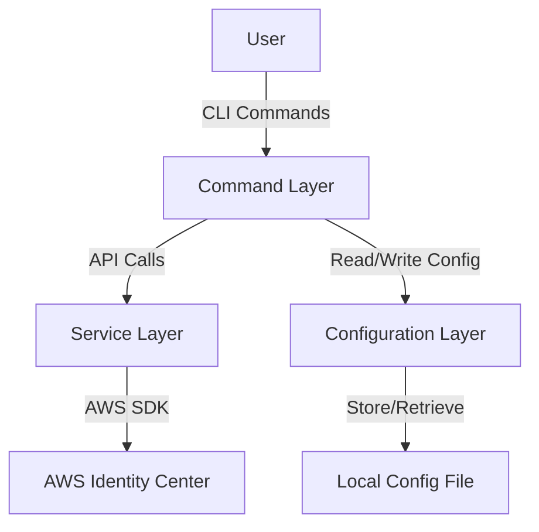

# Permission Set Management Design Document

## Overview

The Permission Set Management feature extends the awsideman CLI tool to enable administrators to manage permission sets within AWS Identity Center. Permission sets are collections of one or more IAM policies that define the level of access users and groups have to AWS accounts. This feature will provide a consistent command-line interface for listing, retrieving, creating, updating, and deleting permission sets, following the same command structure and user experience as the existing user management commands.

The initial implementation will focus on managing permission sets with AWS-managed policies, with potential future extensions to support customer-managed policies, inline policies, and permission boundaries.

## Architecture

The Permission Set Management feature will follow the existing architecture of the awsideman CLI tool:

1. **Command Layer**: Implements the CLI commands using Typer, handling user input, validation, and output formatting.
2. **Service Layer**: Interacts with the AWS Identity Center API through boto3 clients.
3. **Configuration Layer**: Uses the existing configuration management to store and retrieve AWS profiles and SSO instance information.



## Components and Interfaces

### Command Module

A new command module `permission_set.py` will be added to the `src/awsideman/commands` directory, implementing the following commands:

1. `permission-set list`: List all permission sets in the Identity Center
2. `permission-set get`: Get detailed information about a specific permission set
3. `permission-set create`: Create a new permission set
4. `permission-set update`: Update an existing permission set
5. `permission-set delete`: Delete a permission set

Each command will follow the same pattern as existing commands:
- Accept common parameters like `--profile` for AWS profile selection
- Validate inputs and handle errors consistently
- Format output using Rich tables and panels
- Return structured data for programmatic use

### AWS Client Integration

The feature will use the existing `AWSClientManager` class to interact with the AWS Identity Center API. The primary services used will be:

1. **SSO Admin Service**: For permission set operations (list, get, create, update, delete)
2. **Identity Store Service**: For retrieving identity information when needed

### Command-Line Interface

The permission set commands will be added to the main CLI application in `cli.py`:

```python
from .commands import profile, sso, user, permission_set

app.add_typer(permission_set.app, name="permission-set")
```

## Data Models

### Permission Set

The permission set data model will include:

- **Name**: Unique identifier for the permission set within the Identity Center
- **ARN**: Amazon Resource Name for the permission set
- **Description**: Optional description of the permission set
- **Session Duration**: Duration of sessions granted using this permission set
- **Relay State**: URL to which users are redirected after authentication
- **Managed Policies**: List of AWS-managed policies attached to the permission set

### AWS-Managed Policy

- **ARN**: Amazon Resource Name for the AWS-managed policy
- **Name**: Display name of the policy
- **Description**: Description of the policy
- **Path**: Path of the policy

## Implementation Details

### Permission Set List Command

The `permission-set list` command will:

1. Validate the AWS profile and SSO instance configuration
2. Call the `ListPermissionSets` API to retrieve permission sets
3. Format the results in a table showing name, ARN, and description
4. Support pagination for large result sets
5. Support filtering by name or other attributes

```python
@app.command("list")
def list_permission_sets(
    filter: Optional[str] = typer.Option(None, "--filter", "-f", help="Filter permission sets by attribute"),
    limit: Optional[int] = typer.Option(None, "--limit", "-l", help="Maximum number of permission sets to return"),
    next_token: Optional[str] = typer.Option(None, "--next-token", "-n", help="Pagination token"),
    profile: Optional[str] = typer.Option(None, "--profile", "-p", help="AWS profile to use"),
):
    """List all permission sets in the Identity Center."""
    # Implementation details
```

### Permission Set Get Command

The `permission-set get` command will:

1. Accept a permission set name or ARN as input
2. Call the `DescribePermissionSet` API to retrieve detailed information
3. Call the `ListManagedPoliciesInPermissionSet` API to retrieve attached policies
4. Format the results in a detailed panel showing all attributes
5. Handle errors for non-existent permission sets

```python
@app.command("get")
def get_permission_set(
    identifier: str = typer.Argument(..., help="Permission set name or ARN"),
    profile: Optional[str] = typer.Option(None, "--profile", "-p", help="AWS profile to use"),
):
    """Get detailed information about a specific permission set."""
    # Implementation details
```

### Permission Set Create Command

The `permission-set create` command will:

1. Accept required parameters (name) and optional parameters (description, session duration, relay state)
2. Accept AWS-managed policy ARNs to attach
3. Call the `CreatePermissionSet` API to create the permission set
4. Call the `AttachManagedPolicyToPermissionSet` API for each policy
5. Display the created permission set details
6. Handle errors for duplicate names or invalid inputs

```python
@app.command("create")
def create_permission_set(
    name: str = typer.Option(..., "--name", help="Name for the permission set"),
    description: Optional[str] = typer.Option(None, "--description", help="Description for the permission set"),
    session_duration: Optional[str] = typer.Option("PT1H", "--session-duration", help="Session duration (ISO-8601 format)"),
    relay_state: Optional[str] = typer.Option(None, "--relay-state", help="Relay state URL"),
    managed_policy: Optional[List[str]] = typer.Option(None, "--managed-policy", help="AWS-managed policy ARN to attach"),
    profile: Optional[str] = typer.Option(None, "--profile", "-p", help="AWS profile to use"),
):
    """Create a new permission set in the Identity Center."""
    # Implementation details
```

### Permission Set Update Command

The `permission-set update` command will:

1. Accept a permission set name or ARN as input
2. Accept optional parameters to update (description, session duration, relay state)
3. Accept AWS-managed policy ARNs to attach or detach
4. Call the `UpdatePermissionSet` API to update the permission set
5. Call the `AttachManagedPolicyToPermissionSet` or `DetachManagedPolicyFromPermissionSet` APIs as needed
6. Display the updated permission set details
7. Handle errors for non-existent permission sets or invalid inputs

```python
@app.command("update")
def update_permission_set(
    identifier: str = typer.Argument(..., help="Permission set name or ARN"),
    description: Optional[str] = typer.Option(None, "--description", help="Description for the permission set"),
    session_duration: Optional[str] = typer.Option(None, "--session-duration", help="Session duration (ISO-8601 format)"),
    relay_state: Optional[str] = typer.Option(None, "--relay-state", help="Relay state URL"),
    add_managed_policy: Optional[List[str]] = typer.Option(None, "--add-managed-policy", help="AWS-managed policy ARN to attach"),
    remove_managed_policy: Optional[List[str]] = typer.Option(None, "--remove-managed-policy", help="AWS-managed policy ARN to detach"),
    profile: Optional[str] = typer.Option(None, "--profile", "-p", help="AWS profile to use"),
):
    """Update an existing permission set in the Identity Center."""
    # Implementation details
```

### Permission Set Delete Command

The `permission-set delete` command will:

1. Accept a permission set name or ARN as input
2. Call the `DeletePermissionSet` API to delete the permission set
3. Display a confirmation message
4. Handle errors for non-existent permission sets

```python
@app.command("delete")
def delete_permission_set(
    identifier: str = typer.Argument(..., help="Permission set name or ARN"),
    profile: Optional[str] = typer.Option(None, "--profile", "-p", help="AWS profile to use"),
):
    """Delete a permission set from the Identity Center."""
    # Implementation details
```

## Error Handling

The feature will implement comprehensive error handling:

1. **Input Validation**: Validate all user inputs before making API calls
2. **AWS API Errors**: Handle and display AWS API errors with clear messages
3. **Permission Errors**: Detect and provide guidance for permission-related issues
4. **Network Errors**: Handle network connectivity issues with appropriate retry mechanisms
5. **Configuration Errors**: Validate profile and SSO instance configuration

Error messages will be formatted consistently using Rich, with color coding to distinguish different types of errors:
- Red for errors
- Yellow for warnings
- Blue for informational messages
- Green for success messages

## Testing Strategy

The testing strategy will include:

### Unit Tests

Unit tests will be created for each command in the `permission_set.py` module, focusing on:
- Input validation
- Error handling
- Output formatting
- Parameter processing

Tests will use mocking to simulate AWS API responses and errors.

### Integration Tests

Integration tests will verify the interaction with the AWS API, focusing on:
- Successful API calls
- Error handling for API responses
- End-to-end command execution

These tests will require AWS credentials and an Identity Center instance for testing.

### Test Files

Test files will be organized in the `tests/commands` directory:
- `test_permission_set_list.py`
- `test_permission_set_get.py`
- `test_permission_set_create.py`
- `test_permission_set_update.py`
- `test_permission_set_delete.py`
- `test_permission_set_helpers.py` (for shared helper functions)

## Design Decisions and Rationales

### Command Structure

The command structure follows the existing pattern in awsideman for consistency:
- Main command: `permission-set`
- Subcommands: `list`, `get`, `create`, `update`, `delete`

This structure is intuitive for users familiar with the existing commands and follows CLI best practices.

### AWS-Managed Policies Only

The initial implementation focuses on AWS-managed policies for simplicity and to meet the core requirements. This approach allows for a faster implementation while providing the most commonly used functionality. Future extensions can add support for:
- Customer-managed policies
- Inline policies
- Permission boundaries

### Identifier Handling

The design supports both permission set names and ARNs as identifiers, providing flexibility for users. The implementation will:
1. Check if the identifier is an ARN (contains "arn:aws:")
2. If not, treat it as a name and search for the corresponding permission set

This approach simplifies the user experience by not requiring separate parameters for names and ARNs.

### Pagination Handling

For the `list` command, pagination is handled interactively by default, with options for:
1. Interactive pagination (press Enter for next page)
2. Manual pagination using `--next-token`
3. Limiting results with `--limit`

This approach balances usability for interactive sessions with flexibility for scripting.

### Policy Management

For policy management in the `create` and `update` commands:
1. `create` allows attaching policies during creation
2. `update` allows both adding and removing policies

This separation of concerns makes the commands more intuitive and follows the principle of least surprise.

## Future Enhancements

While not part of the initial implementation, the following enhancements could be considered for future versions:

1. Support for customer-managed policies
2. Support for inline policies
3. Support for permission boundaries
4. Assignment management (assigning permission sets to users and groups)
5. Provisioning to AWS accounts
6. Import/export of permission set configurations
7. Comparison of permission sets
8. Visualization of permission set policies
