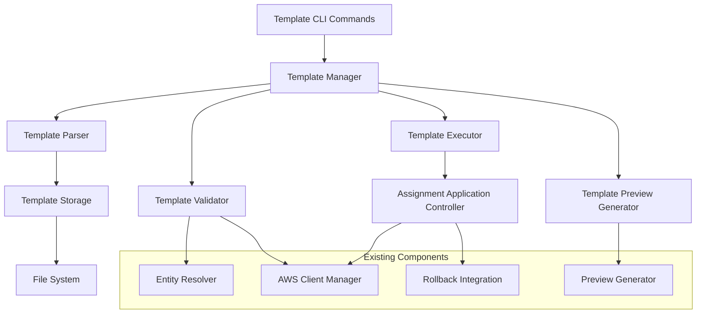

# Design Document

## Overview

The template support feature introduces a declarative approach to managing AWS IAM Identity Center permission assignments through reusable templates. This feature extends the existing awsideman CLI with template-based operations that allow users to define, validate, preview, and apply permission assignment configurations at scale.

The design leverages existing infrastructure including the AWS client management system, configuration utilities, entity resolution, and assignment management components while introducing new template-specific modules for parsing, validation, and execution.

## Architecture

### High-Level Architecture



### Component Integration

The template system integrates with existing awsideman components:

- **AWS Client Manager**: For AWS API interactions
- **Entity Resolver**: For resolving user/group names to IDs
- **Assignment Copier**: For applying permission assignments
- **Rollback System**: For tracking template operations
- **Configuration System**: For template storage location settings
- **Multi-account Operations**: For account filtering and selection

## Components and Interfaces

### 1. Template Data Models

```python
@dataclass
class TemplateMetadata:
    """Template metadata and documentation."""
    name: str
    description: Optional[str] = None
    version: Optional[str] = None
    author: Optional[str] = None
    created_at: Optional[datetime] = None
    updated_at: Optional[datetime] = None

@dataclass
class TemplateTarget:
    """Defines assignment targets (accounts)."""
    account_ids: Optional[List[str]] = None
    account_tags: Optional[Dict[str, str]] = None
    exclude_accounts: Optional[List[str]] = None

@dataclass
class TemplateAssignment:
    """Individual assignment definition within a template."""
    entities: List[str]  # user:name or group:name format
    permission_sets: List[str]  # permission set names or ARNs
    targets: TemplateTarget

@dataclass
class Template:
    """Complete template definition."""
    metadata: TemplateMetadata
    assignments: List[TemplateAssignment]

    @classmethod
    def from_dict(cls, data: Dict[str, Any]) -> 'Template'

    def to_dict(self) -> Dict[str, Any]

    def validate_structure(self) -> List[str]
```

### 2. Template Parser

```python
class TemplateParser:
    """Handles parsing of template files in YAML/JSON formats."""

    def parse_file(self, file_path: Path) -> Template:
        """Parse template from file."""

    def parse_string(self, content: str, format: str) -> Template:
        """Parse template from string content."""

    def _detect_format(self, file_path: Path) -> str:
        """Auto-detect file format from extension."""

    def _parse_yaml(self, content: str) -> Dict[str, Any]:
        """Parse YAML content."""

    def _parse_json(self, content: str) -> Dict[str, Any]:
        """Parse JSON content."""
```

### 3. Template Validator

```python
class TemplateValidator:
    """Validates template structure and resolves entities."""

    def __init__(self, client_manager: AWSClientManager, instance_arn: str, identity_store_id: str):
        self.entity_resolver = EntityResolver(client_manager, instance_arn, identity_store_id)
        self.client_manager = client_manager

    def validate_template(self, template: Template) -> ValidationResult:
        """Comprehensive template validation."""

    def validate_structure(self, template: Template) -> List[str]:
        """Validate template structure and required fields."""

    def validate_entities(self, template: Template) -> List[str]:
        """Validate that all entities exist and are resolvable."""

    def validate_permission_sets(self, template: Template) -> List[str]:
        """Validate that all permission sets exist."""

    def validate_accounts(self, template: Template) -> List[str]:
        """Validate account IDs and tag filters."""

@dataclass
class ValidationResult:
    """Result of template validation."""
    is_valid: bool
    errors: List[str]
    warnings: List[str]
    resolved_entities: Dict[str, Any]
    resolved_accounts: List[str]
```

### 4. Template Storage Manager

```python
class TemplateStorageManager:
    """Manages template file storage and discovery."""

    def __init__(self, config: Config):
        self.config = config
        self.templates_dir = self._get_templates_directory()

    def list_templates(self) -> List[TemplateInfo]:
        """List all available templates."""

    def get_template(self, name: str) -> Optional[Template]:
        """Load template by name."""

    def save_template(self, template: Template, file_path: Optional[Path] = None) -> Path:
        """Save template to storage."""

    def delete_template(self, name: str) -> bool:
        """Delete template from storage."""

    def template_exists(self, name: str) -> bool:
        """Check if template exists."""

    def _get_templates_directory(self) -> Path:
        """Get templates directory from config or default."""

@dataclass
class TemplateInfo:
    """Basic template information for listing."""
    name: str
    file_path: Path
    metadata: TemplateMetadata
    assignment_count: int
    entity_count: int
```

### 5. Template Executor

```python
class TemplateExecutor:
    """Executes template operations (apply, dry-run)."""

    def __init__(self, client_manager: AWSClientManager, instance_arn: str, identity_store_id: str):
        self.client_manager = client_manager
        self.entity_resolver = EntityResolver(client_manager, instance_arn, identity_store_id)
        self.assignment_copier = AssignmentCopier(...)

    def apply_template(self, template: Template, dry_run: bool = False) -> ExecutionResult:
        """Apply template assignments."""

    def preview_template(self, template: Template) -> PreviewResult:
        """Generate preview of template execution."""

    def _resolve_template_accounts(self, targets: TemplateTarget) -> List[str]:
        """Resolve account targets using multi-account logic."""

    def _create_assignments(self, template: Template, dry_run: bool) -> List[AssignmentResult]:
        """Create individual assignments from template."""

@dataclass
class ExecutionResult:
    """Result of template execution."""
    success: bool
    assignments_created: List[AssignmentResult]
    assignments_skipped: List[AssignmentResult]
    assignments_failed: List[AssignmentResult]
    operation_id: Optional[str]  # For rollback tracking
    execution_time: float
    error_message: Optional[str] = None

@dataclass
class AssignmentResult:
    """Result of individual assignment operation."""
    entity_name: str
    entity_type: str
    permission_set_name: str
    account_id: str
    account_name: str
    status: str  # 'created', 'skipped', 'failed'
    error_message: Optional[str] = None
```

### 6. Template CLI Commands

```python
# New template command module
class TemplateCommands:
    """CLI commands for template operations."""

    def create_template(self, name: str, example: bool = False) -> None:
        """Create new template file."""

    def validate_template(self, template_file: str) -> None:
        """Validate template structure and entities."""

    def preview_template(self, template_file: str, output_format: str = "table") -> None:
        """Preview template execution."""

    def apply_template(self, template_file: str, dry_run: bool = False) -> None:
        """Apply template assignments."""

    def list_templates(self) -> None:
        """List available templates."""

    def show_template(self, template_name: str) -> None:
        """Display template contents."""
```

## Data Models

### Template File Format

Templates support both YAML and JSON formats. The YAML format is preferred for readability:

```yaml
metadata:
  name: "developer-access-template"
  description: "Standard developer access across development accounts"
  version: "1.0"
  author: "DevOps Team"

assignments:
  - entities:
      - "user:john.doe"
      - "user:jane.smith"
      - "group:developers"
    permission_sets:
      - "DeveloperAccess"
      - "ReadOnlyAccess"
    targets:
      account_tags:
        Environment: "development"
        Team: "backend"
      exclude_accounts:
        - "123456789012"  # Production account

  - entities:
      - "group:senior-developers"
    permission_sets:
      - "PowerUserAccess"
    targets:
      account_ids:
        - "234567890123"
        - "345678901234"
```

### Configuration Integration

Templates integrate with the existing configuration system:

```yaml
# ~/.awsideman/config.yaml
templates:
  storage_directory: "~/.awsideman/templates"
  default_format: "yaml"
  validation:
    strict_mode: true
    require_metadata: false
  execution:
    default_dry_run: false
    parallel_execution: true
    batch_size: 10
```

## Error Handling

### Validation Errors

- **Structure Errors**: Missing required fields, invalid format
- **Entity Resolution Errors**: Unknown users/groups, invalid entity references
- **Permission Set Errors**: Non-existent permission sets, invalid ARNs
- **Account Errors**: Invalid account IDs, unresolvable tag filters
- **Access Errors**: Insufficient permissions for target accounts

### Execution Errors

- **API Errors**: AWS service errors, rate limiting, temporary failures
- **Conflict Errors**: Assignment already exists, conflicting assignments
- **Partial Failures**: Some assignments succeed while others fail
- **Rollback Errors**: Failures during rollback operations

### Error Recovery

- **Retry Logic**: Automatic retry for transient failures
- **Partial Success Handling**: Continue execution despite individual failures
- **Rollback Integration**: Track successful operations for potential rollback
- **Detailed Error Reporting**: Clear error messages with remediation suggestions

## Testing Strategy

### Unit Tests

- **Template Parser Tests**: Validate YAML/JSON parsing, error handling
- **Template Validator Tests**: Test entity resolution, validation logic
- **Template Executor Tests**: Mock AWS operations, test execution flow
- **Storage Manager Tests**: File operations, template discovery
- **CLI Command Tests**: Command parsing, output formatting

### Integration Tests

- **End-to-End Template Flow**: Create, validate, preview, apply templates
- **AWS Integration Tests**: Real AWS operations with test accounts
- **Multi-account Integration**: Test account filtering and selection
- **Rollback Integration**: Test operation tracking and rollback

### Performance Tests

- **Large Template Handling**: Templates with many assignments
- **Parallel Execution**: Concurrent assignment operations
- **Account Resolution**: Performance of tag-based filtering
- **Template Storage**: File system operations at scale

### Test Data

- **Sample Templates**: Various template configurations for testing
- **Mock AWS Responses**: Consistent test data for AWS operations
- **Error Scenarios**: Templates with various validation/execution errors
- **Edge Cases**: Empty templates, malformed files, permission edge cases

## Security Considerations

### Template Security

- **Input Validation**: Strict validation of all template inputs
- **Path Traversal Protection**: Secure file path handling
- **Permission Validation**: Verify user has permission for target operations
- **Sensitive Data**: Avoid storing sensitive information in templates

### Execution Security

- **Least Privilege**: Only request necessary AWS permissions
- **Audit Logging**: Log all template operations for audit trails
- **Rollback Capability**: Ensure operations can be safely reversed
- **Dry Run Mode**: Safe preview mode for validation

### Access Control

- **Template Access**: Control who can create/modify templates
- **Execution Permissions**: Verify permissions before applying templates
- **Account Boundaries**: Respect account access limitations
- **Cross-Account Security**: Secure handling of multi-account operations
